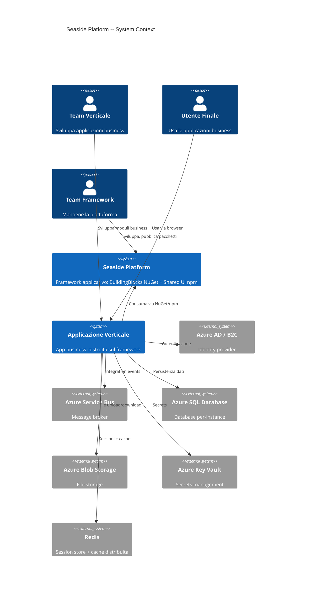
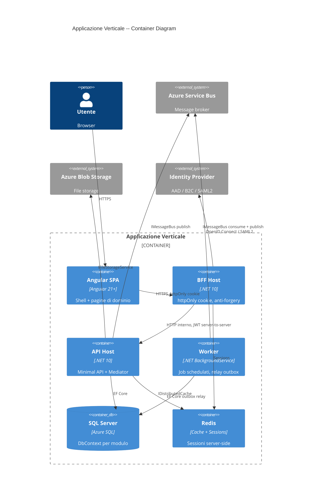
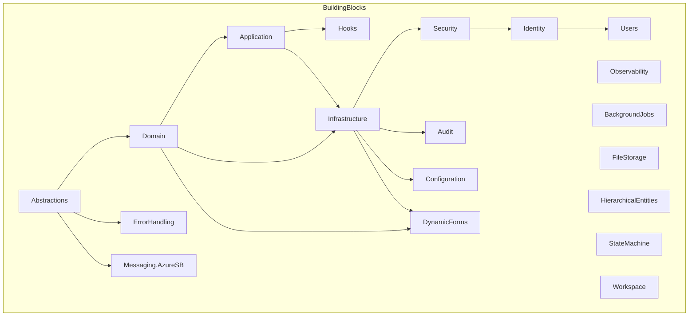
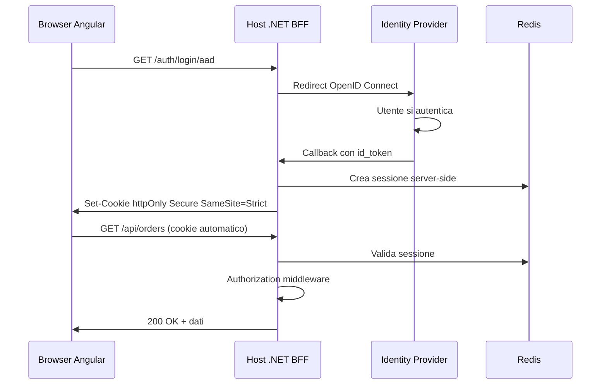
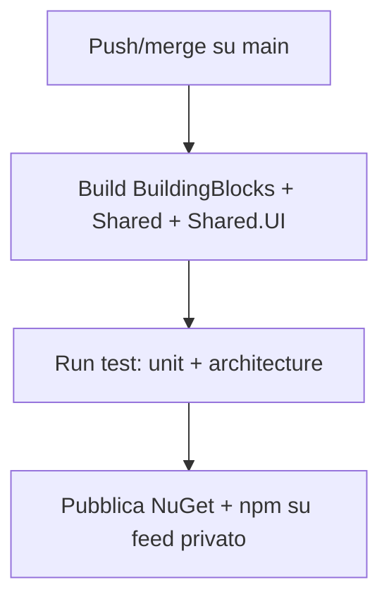

# Seaside Framework -- Guida alla Costruzione

> Documento operativo per il **Team Framework**: tutto cio' che serve per costruire i BuildingBlocks, Shared, Shared.UI e ServiceDefaults.
> Derivato da: [Architecture Decision Book](ARCHITECTURE_DECISION_BOOK.md)
> Ultimo aggiornamento: 2026-04-01

---

## Indice

- [1. Scopo e Principi](#1-scopo-e-principi)
- [2. Cruscotto Decisioni](#2-cruscotto-decisioni)
- [3. Stack Tecnologico](#3-stack-tecnologico)
- [4. Pattern Architetturali Core](#4-pattern-architetturali-core)
- [5. Persistenza e Data Access](#5-persistenza-e-data-access)
- [6. Identity, Autenticazione e Sicurezza](#6-identity-autenticazione-e-sicurezza)
- [7. Struttura del Framework Repo](#7-struttura-del-framework-repo)
- [8. Building Blocks](#8-building-blocks)
- [9. Shared UI](#9-shared-ui)
- [10. Messaging e Comunicazione](#10-messaging-e-comunicazione)
- [11. Testing](#11-testing)
- [12. CI/CD e Packaging](#12-cicd-e-packaging)
- [13. Backlog Framework](#13-backlog-framework)
- [14. Rischi e Mitigazioni](#14-rischi-e-mitigazioni)
- [Appendice A -- Glossario](#appendice-a----glossario)
- [Appendice B -- Sistema di Classificazione Capability](#appendice-b----sistema-di-classificazione-capability)

---

## 1. Scopo e Principi

### 1.1 Cosa costruiamo

Seaside e' una **application platform interna**: un framework condiviso che funge da base tecnica, architetturale e UI per molteplici applicazioni business indipendenti. Il framework centralizza:

- Standard architetturali e convenzioni
- Building blocks tecnici trasversali
- Sicurezza, identity, audit, observability
- UI shell, theming e componenti condivisi
- Gestione errori, configurazione, background jobs

Le applicazioni business **compongono** il framework, non lo ereditano rigidamente.

| Il framework E' | Il framework NON E' |
|---|---|
| Base tecnica condivisa | Un'applicazione business |
| Building blocks riusabili | Contenitore di use case specifici |
| Shell UI e design system | Repository di pagine di dominio |
| Standard di sicurezza e audit | Logica di workflow di una singola app |
| Convenzioni e guardrail | Scorciatoia per la prima migrazione |
| Pacchetti NuGet/npm consumati dai verticali | Monorepo che contiene codice dei prodotti |

### 1.2 Regola del confine

> **Se un componente non e' ragionevolmente riusabile da almeno una seconda applicazione plausibile, non deve stare nel framework.**

### 1.3 Principi architetturali

1. **Separazione framework/app** -- confini forti, dipendenze unidirezionali
2. **Modular monolith** -- moduli isolati composti dagli host, non microservizi frammentati
3. **Worker separati dove serve** -- processi autonomi per responsabilita' che richiedono isolamento
4. **Coerenza imposta, non suggerita** -- regole verificabili, non linee guida opzionali
5. **Composizione sopra ereditarieta'** -- le app compongono building blocks, non estendono classi base rigide
6. **Aggiornabilita' centralizzata** -- un aggiornamento ai pacchetti si propaga a tutte le app
7. **Niente porting 1:1** -- ogni capability legacy viene classificata, ripensata e ricostruita

### 1.4 Diagrammi architetturali

#### C4 Context



#### C4 Container -- Applicazione Verticale



#### Building Blocks e dipendenze



> Fonte: [Architecture Decision Book](ARCHITECTURE_DECISION_BOOK.md), Cap. 1

---

## 2. Cruscotto Decisioni

Tutte le 35 decisioni architetturali confermate. Riferimento rapido per il team framework.

### Stack Tecnologico

| ID | Decisione | Valore |
|---|---|---|
| D-01 | Runtime target | .NET 10 |
| D-02 | Orchestrazione | .NET Aspire |
| D-03 | Package management | Central Package Management |
| D-04 | Formato progetti | SDK-style |

### UI

| ID | Decisione | Valore |
|---|---|---|
| D-10 | Tecnologia frontend | Angular 21+ |
| D-11 | Component library | ng-zorro-antd (baseline) + Syncfusion (avanzati). Wrapper `<seaside-*>` con API unica |
| D-12 | Theming | Design tokens imposti dal framework |
| D-13 | Dynamic Forms | Capability PLATFORM. @ngx-formly |

### Stile API

| ID | Decisione | Valore |
|---|---|---|
| D-20 | Stile API | Vertical Slices + Minimal APIs + Mediator (DDD-aligned) |
| D-21 | Libreria mediator | Custom lightweight in BuildingBlocks.Application |
| D-22 | Result types | Result\<T\> + FluentValidation + Problem Details (RFC 9457) |
| D-23 | Architettura moduli | Hexagonal Architecture (Ports & Adapters) |

### Persistenza

| ID | Decisione | Valore |
|---|---|---|
| D-30 | Database | SQL Server |
| D-31 | ORM | Entity Framework Core |
| D-32 | DbContext strategy | DbContext per modulo + DbContext framework |
| D-33 | Migration strategy | EF Migrations per modulo |
| D-34 | Repository pattern | Si, repository come Port esagonale |
| D-35 | Read/Write separation | CQRS leggero, non mandatorio |
| D-37 | Connection string | Environment variables, mai hardcoded |

### Identity e Sicurezza

| ID | Decisione | Valore |
|---|---|---|
| D-40 | Provider auth | AAD, B2C, Google, SAML2, custom forms, Teams, PBI |
| D-41 | Pattern auth | JWT Bearer + multi-scheme |
| D-42 | Autorizzazione | RBAC permission-based + Workspace scoping (opt-in) |
| D-43 | Utenti/ruoli | Framework-level |
| D-44 | BFF | httpOnly cookie, JWT mai esposto al browser |
| D-45 | Session management | Server-side (Redis/SQL), multi-sessione configurabile |
| D-46 | Secrets | Azure Key Vault + env var |
| D-47 | Security hardening | CSP, CORS, rate limiting, anti-forgery, HtmlSanitizer |

### Repository e Comunicazione

| ID | Decisione | Valore |
|---|---|---|
| D-50 | Multi-tenancy | Non prevista |
| D-51 | Modello repo | Multi-repo: framework NuGet/npm, verticali in repo separati |
| D-52 | Root namespace | Seaside |
| D-53 | Solution structure | Una solution per framework, una per verticale |
| D-55 | CI/CD | Docker image per servizio, IT deploya su Azure Container Apps |
| D-56 | Eventual consistency | Mandatorio tra moduli |
| D-57 | Comunicazione cross-modulo | Integration Events via broker |
| D-58 | Message broker | Azure Service Bus (primario) + NATS JetStream (futuro) |
| D-59 | Delivery guarantee | Outbox/Inbox pattern |

### Building Blocks

| ID | Decisione | Valore |
|---|---|---|
| D-60 | Elenco BB | 19 building blocks confermati |
| D-61 | Granularita' | Un .csproj per BB |
| D-62 | Abstractions strategy | Ibrido: nucleo comune + interfacce per-BB |

### Testing

| ID | Decisione | Valore |
|---|---|---|
| D-80 | Test framework | xUnit (backend), Jest (frontend), Playwright (E2E) |
| D-81 | Architecture tests | NetArchTest |
| D-82 | Integration tests | Testcontainers |

> Fonte: [Architecture Decision Book](ARCHITECTURE_DECISION_BOOK.md), Cap. 2

---

## 3. Stack Tecnologico

### 3.1 Runtime -- .NET 10 (D-01)

Target: **.NET 10** (LTS). Accesso completo a Minimal APIs, filtri, gruppi, OpenAPI, Native AOT per worker.

### 3.2 Orchestrazione -- .NET Aspire (D-02)

- **AppHost**: orchestra servizi, database, worker. Non contiene business logic.
- **ServiceDefaults**: configura OpenTelemetry, health checks, Polly, service discovery. Solo standard tecnici.

**Vincolo**: ServiceDefaults contiene solo standard tecnici. Logica condivisa va nei BuildingBlocks o in Shared.

### 3.3 Central Package Management (D-03)

File `Directory.Packages.props` nella root del framework repo per centralizzare tutte le versioni NuGet.

### 3.4 Formato Progetti -- SDK-style (D-04)

Tutti i progetti in formato SDK-style. Nessun progetto in formato legacy.

### 3.5 Frontend -- Angular 21+ (D-10)

Cosa il framework deve fornire lato frontend:

- **Shell applicativa** -- pacchetto npm `@seaside/shell`
- **Design system e theming** -- pacchetto npm `@seaside/theming`
- **Componenti UI riusabili** -- pacchetto npm `@seaside/components`
- **Convenzioni UX standard** (validazione, empty states, loading, errori)
- **Dynamic Forms engine** (@ngx-formly) come capability PLATFORM

> Fonte: [Architecture Decision Book](ARCHITECTURE_DECISION_BOOK.md), Cap. 3-4

---

## 4. Pattern Architetturali Core

Questa sezione definisce i pattern che il framework **implementa e fornisce** ai verticali.

### 4.1 Vertical Slices + Mediator (D-20, D-21)

Il framework inietta i propri standard trasversali via mediator pipeline:

```
[Minimal API Endpoint]
        |
        v
[Mediator Pipeline]
        |
  [Validation Behavior]     <-- framework
  [Logging Behavior]         <-- framework
  [Authorization Behavior]   <-- framework
  [Audit Behavior]           <-- framework
  [Error Handling Behavior]  <-- framework
        |
        v
[Business Handler]           <-- scritto dal verticale
        |
        v
[Response]
```

#### Interfacce da implementare in BuildingBlocks.Abstractions

```csharp
public interface ICommand<TResponse> { }
public interface IQuery<TResponse> { }
public interface ICommandHandler<TCommand, TResponse> where TCommand : ICommand<TResponse>
{
    Task<TResponse> Handle(TCommand command, CancellationToken ct);
}
public interface IQueryHandler<TQuery, TResponse> where TQuery : IQuery<TResponse>
{
    Task<TResponse> Handle(TQuery query, CancellationToken ct);
}

public interface INotification { }
public interface INotificationHandler<TNotification> where TNotification : INotification
{
    Task Handle(TNotification notification, CancellationToken ct);
}

public interface IPipelineBehavior<TRequest, TResponse>
{
    Task<TResponse> Handle(TRequest request, RequestHandlerDelegate<TResponse> next, CancellationToken ct);
}

public interface IMediator
{
    Task<TResponse> Send<TResponse>(ICommand<TResponse> command, CancellationToken ct);
    Task<TResponse> Send<TResponse>(IQuery<TResponse> query, CancellationToken ct);
    Task Publish<TNotification>(TNotification notification, CancellationToken ct)
        where TNotification : INotification;
}
```

#### Implementazione in BuildingBlocks.Application

```csharp
public class SeasideMediator : IMediator
{
    private readonly IServiceProvider _provider;
    // ~200 righe: risolve handler + behaviors, costruisce pipeline, esegue
}
```

#### Pipeline behaviors forniti dal framework

| Behavior | Scopo | Ordine |
|---|---|---|
| `LoggingBehavior` | Log strutturato request/response | 1 |
| `ValidationBehavior` | FluentValidation validators | 2 |
| `AuthorizationBehavior` | Verifica permessi | 3 |
| `AuditBehavior` | Audit trail (solo command) | 4 |
| `ErrorHandlingBehavior` | Eccezioni -> Result\<T\> | 5 |

#### Registration DI

```csharp
builder.AddSeasideMediator(typeof(CreateOrderHandler).Assembly);
```

### 4.2 Result Types (D-22)

```csharp
public class Result<T>
{
    public bool IsSuccess { get; }
    public T Value { get; }
    public Error Error { get; }
}
```

Ogni handler ritorna `Result<T>`. Il framework mappa automaticamente in Problem Details (RFC 9457) per le risposte HTTP.

### 4.3 DDD Building Blocks da fornire

Il framework fornisce in `BuildingBlocks.Domain`:

| Pattern DDD | Tipo da implementare | Ruolo |
|---|---|---|
| Entity | `Entity<TId>` | Oggetto con identita' |
| Aggregate Root | `AggregateRoot<TId>` | Radice di consistenza transazionale |
| Value Object | `ValueObject` | Immutabile, definito dai propri attributi |
| Domain Event | `DomainEvent` | Evento significativo del dominio |

Il dispatching dei domain events avviene automaticamente al `SaveChanges()` tramite interceptor EF in `BuildingBlocks.Infrastructure`.

### 4.4 Hexagonal Architecture (D-23)

Il framework definisce e impone le regole di dipendenza intra-modulo:

| Layer sorgente | Puo' dipendere da | NON puo' dipendere da |
|---|---|---|
| `Domain/` | Solo BB.Domain, BB.Abstractions | Application, Infrastructure, Endpoints |
| `Application/` | Domain/, BB.Application, BB.Abstractions | Infrastructure, Endpoints |
| `Infrastructure/` | Domain/, Application/, BB.Infrastructure, pacchetti esterni | Endpoints |
| `Endpoints/` | Application/ (via mediator), BB.Abstractions | Domain, Infrastructure |

Queste regole sono **verificate da architecture tests** (NetArchTest) a ogni build.

### 4.5 Struttura modulo tipo (pattern imposto)

```
Modules/
  └── [NomeModulo]/
      ├── [NomeModulo].csproj
      ├── Domain/
      │   ├── Entities/
      │   ├── ValueObjects/
      │   ├── Events/
      │   ├── Errors/
      │   └── Abstractions/       # Ports
      ├── Application/             # Vertical slices (handlers, validators)
      │   └── EventHandlers/
      ├── Infrastructure/          # Driven adapters (DbContext, repos)
      ├── Endpoints/               # Minimal API sottilissimi
      └── DependencyInjection.cs
```

> Fonte: [Architecture Decision Book](ARCHITECTURE_DECISION_BOOK.md), Cap. 5

---

## 5. Persistenza e Data Access

### 5.1 DbContext Strategy (D-32)

**Scelta**: DbContext per modulo + DbContext di framework per entita' di piattaforma (identity, audit, configuration).

I moduli business **non accedono mai** al DbContext di altri moduli ne' al DbContext di framework:

| Dato necessario | Come accederlo |
|---|---|
| Utente corrente | `ICurrentUser` iniettato dal framework |
| Dati di un altro modulo | Integration event o API interna |
| Configurazione framework | `IModuleConfiguration` |

### 5.2 Repository Pattern (D-34)

Repository come **Port** esagonale. L'handler usa solo l'interfaccia, mai il DbContext:

```csharp
// Domain/Abstractions/ -- Port
public interface IOrderRepository
{
    Task<Order?> GetByIdAsync(OrderId id, CancellationToken ct);
    Task AddAsync(Order order, CancellationToken ct);
}

// Infrastructure/ -- Driven Adapter
public class OrderRepository : IOrderRepository
{
    private readonly OrdersDbContext _db;
}

// Application/ -- usa solo il Port
public class CreateOrderHandler : ICommandHandler<CreateOrderCommand, Result<OrderId>>
{
    private readonly IOrderRepository _repository;
}
```

### 5.3 CQRS Leggero (D-35)

Il framework fornisce `ICommand<T>` e `IQuery<T>` con pipeline behavior differenziati (audit solo sui command, caching sulle query). Ogni modulo decide se adottare la separazione.

Le query possono bypassare il repository e usare un read-only port (`IOrderReadModel`).

### 5.4 EF Migrations per Modulo (D-33)

Ogni DbContext ha le proprie migrazioni. Al deploy EF applica automaticamente le migrazioni pendenti.

### 5.5 Connection String Strategy (D-37)

Mai hardcodate. Il modulo usa sempre `Configuration.GetConnectionString("appdb")`. L'AppHost inietta il valore:

```csharp
// Dev: container locale
sql = builder.AddSqlServer("sql").AddDatabase("appdb");
// Prod: connection string dall'esterno
sql = builder.AddConnectionString("appdb");
```

> Fonte: [Architecture Decision Book](ARCHITECTURE_DECISION_BOOK.md), Cap. 6

---

## 6. Identity, Autenticazione e Sicurezza

### 6.1 Cosa il framework deve fornire

- `ICurrentUser`, `ICurrentSession` -- interfacce standard
- BFF pattern con httpOnly cookie (D-44) -- JWT mai esposto al browser
- Middleware di autenticazione multi-provider (D-41)
- Policy di autorizzazione per modulo (D-42)
- Claim enrichment
- Session management server-side (D-45)
- CSRF protection (anti-forgery)
- Security headers (CSP, CORS, HSTS, rate limiting) (D-47)
- Input sanitization (HtmlSanitizer)
- Secrets management (Key Vault + env var) (D-46)

### 6.2 Provider Auth Supportati (D-40, D-41)

| Provider | Scheme ASP.NET Core | Pacchetto |
|---|---|---|
| Custom forms (JWT) | `JwtBearerDefaults` | Built-in |
| Azure AD (Entra ID) | `OpenIdConnectDefaults` | `Microsoft.Identity.Web` |
| Azure AD B2C | `OpenIdConnectDefaults` (istanza separata) | `Microsoft.Identity.Web` |
| Google | `GoogleDefaults` (OAuth2) | `Microsoft.AspNetCore.Authentication.Google` |
| SAML2 | `Saml2Defaults` | `Sustainsys.Saml2.AspNetCore2` |
| Microsoft Teams | Custom scheme | Custom nel framework |
| Power BI | Custom scheme | Custom nel framework |

**Principio**: indipendentemente dal provider, dopo l'autenticazione il browser ha un **httpOnly cookie di sessione**. Il resto del sistema non sa quale provider ha autenticato.

### 6.3 BFF Pattern (D-44)

BFF e API vivono nello **stesso processo** (Host). Il JWT non raggiunge mai il browser.



### 6.4 Autorizzazione Permission-Based (D-42)

```csharp
// Ogni modulo dichiara permessi
public static class OrderPermissions
{
    public const string View = "orders.view";
    public const string Create = "orders.create";
}

// Uso negli endpoint
app.MapGet("/orders", ...).RequirePermission(OrderPermissions.View);

// Uso via behavior
[RequirePermission(OrderPermissions.Create)]
public class CreateOrderCommand : ICommand<Result<OrderId>> { ... }
```

### 6.5 Workspace Scoping (D-42) -- opt-in

```csharp
public interface IWorkspaceContext
{
    Guid? CurrentWorkspaceId { get; }
    bool HasWorkspace { get; }
}

public interface IWorkspaceScopedEntity
{
    Guid WorkspaceId { get; }
}

// EF Global Query Filter automatico
builder.Entity<T>().HasQueryFilter(e =>
    e.WorkspaceId == _workspaceContext.CurrentWorkspaceId);
```

### 6.6 Session Management (D-45)

| Parametro | Default |
|---|---|
| IdleTimeout | 30 min |
| SlidingExpiration | true |
| MaxSessionDuration | 8 ore |
| ConcurrentSessions | true |

Storage: in-memory (dev), Redis (prod) via `IDistributedCache`.

### 6.7 Security Hardening (D-47)

Il framework fornisce **di default**:

- **CORS**: configurabile via `appsettings.json`
- **CSP**: `default-src 'self'`, personalizzabile dai verticali (estendere, non rimuovere)
- **Rate limiting**: globale (100/min/IP) + auth (10/min/IP anti brute-force)
- **Anti-forgery**: ASP.NET Core anti-forgery, header `X-XSRF-TOKEN`
- **HtmlSanitizer**: `IHtmlSanitizer` per rich text
- **Global string trimming**: model binder custom
- **Security headers**: `X-Content-Type-Options: nosniff`, `X-Frame-Options: DENY`, HSTS

### 6.8 Entita' di Piattaforma (D-43)

Gestite nel DbContext framework:

| Entita' | Scopo |
|---|---|
| `User` | Utente del sistema |
| `Role` | Ruolo (raggruppa permessi) |
| `UserRole` | Assegnazione utente-ruolo (opz. scoped per workspace) |
| `Permission` | Permesso granulare (modulo.azione) |
| `RolePermission` | Assegnazione permesso-ruolo |
| `Group` | Gruppo di utenti |
| `UserGroup` | Membership utente-gruppo |
| `UserLogin` | Credenziali per provider (multi-provider) |
| `UserWorkspace` | Accesso utente a workspace + ruolo |
| `AuditLog` | Audit accessi e operazioni |

> Fonte: [Architecture Decision Book](ARCHITECTURE_DECISION_BOOK.md), Cap. 7

---

## 7. Struttura del Framework Repo

### 7.1 Directory Tree

```
SEASYDE_AI/                              # FRAMEWORK REPO
│
├── src/
│   ├── BuildingBlocks/
│   │   ├── Abstractions/               # → NuGet: Seaside.BuildingBlocks.Abstractions
│   │   ├── Application/                # → NuGet: Seaside.BuildingBlocks.Application
│   │   ├── Domain/                     # → NuGet: Seaside.BuildingBlocks.Domain
│   │   ├── Infrastructure/             # → NuGet: Seaside.BuildingBlocks.Infrastructure
│   │   ├── Security/                   # → NuGet: Seaside.BuildingBlocks.Security
│   │   ├── Identity/                   # → NuGet: Seaside.BuildingBlocks.Identity
│   │   ├── Users/                      # → NuGet: Seaside.BuildingBlocks.Users
│   │   ├── Configuration/              # → NuGet: Seaside.BuildingBlocks.Configuration
│   │   ├── Audit/                      # → NuGet: Seaside.BuildingBlocks.Audit
│   │   ├── Observability/              # → NuGet: Seaside.BuildingBlocks.Observability
│   │   ├── BackgroundJobs/             # → NuGet: Seaside.BuildingBlocks.BackgroundJobs
│   │   ├── ErrorHandling/              # → NuGet: Seaside.BuildingBlocks.ErrorHandling
│   │   ├── Hooks/                      # → NuGet: Seaside.BuildingBlocks.Hooks
│   │   ├── FileStorage/                # → NuGet: Seaside.BuildingBlocks.FileStorage
│   │   ├── HierarchicalEntities/       # → NuGet: Seaside.BuildingBlocks.HierarchicalEntities
│   │   ├── StateMachine/               # → NuGet: Seaside.BuildingBlocks.StateMachine
│   │   ├── Workspace/                  # → NuGet: Seaside.BuildingBlocks.Workspace
│   │   ├── Messaging.AzureServiceBus/  # → NuGet: Seaside.BuildingBlocks.Messaging.AzureServiceBus
│   │   └── DynamicForms/               # → NuGet: Seaside.BuildingBlocks.DynamicForms
│   │
│   ├── Shared/
│   │   ├── Contracts/                   # → NuGet: Seaside.Shared.Contracts
│   │   ├── Kernel/                      # → NuGet: Seaside.Shared.Kernel
│   │   └── Utilities/                   # → NuGet: Seaside.Shared.Utilities
│   │
│   ├── Shared.UI/                       # FRONTEND CONDIVISO (Angular)
│   │   ├── shell/                       # → npm: @seaside/shell
│   │   ├── components/                  # → npm: @seaside/components
│   │   └── theming/                     # → npm: @seaside/theming
│   │
│   └── ServiceDefaults/                 # → NuGet: Seaside.ServiceDefaults
│
├── tests/
│   ├── UnitTests/
│   └── ArchitectureTests/
│
├── Directory.Build.props
├── Directory.Packages.props
├── global.json
├── .editorconfig
├── SEASYDE_AI.Framework.sln
└── README.md
```

### 7.2 Solution Structure

```
SEASYDE_AI.Framework.sln
├── [Solution Folder] BuildingBlocks
│   ├── Abstractions.csproj
│   ├── Application.csproj
│   ├── Domain.csproj
│   └── ...
├── [Solution Folder] Shared
│   ├── Contracts.csproj
│   ├── Kernel.csproj
│   └── ...
├── [Solution Folder] ServiceDefaults
└── [Solution Folder] Tests
    ├── UnitTests
    └── ArchitectureTests
```

### 7.3 Regole di Dipendenza (framework repo)

| Progetto sorgente | Puo' dipendere da |
|---|---|
| BuildingBlocks.* | Solo altri BuildingBlocks.* e pacchetti NuGet esterni |
| Shared.* | BuildingBlocks.Abstractions |
| ServiceDefaults | Solo pacchetti Aspire/OpenTelemetry |

| Divieto | Motivazione |
|---|---|
| BuildingBlocks -> Modules | Il framework non conosce i verticali |
| BuildingBlocks -> Hosts | Il framework non conosce gli host |

### 7.4 Naming e Namespace (D-52)

Root namespace: `Seaside`

**NuGet**: `Seaside.BuildingBlocks.*`, `Seaside.Shared.*`, `Seaside.ServiceDefaults`
**npm**: `@seaside/shell`, `@seaside/components`, `@seaside/theming`

> Fonte: [Architecture Decision Book](ARCHITECTURE_DECISION_BOOK.md), Cap. 8

---

## 8. Building Blocks

### 8.1 Elenco Completo (D-60)

| Building Block | Scopo | Stato |
|---|---|---|
| **Abstractions** | IEntity, IValueObject, IAuditableEntity, ICurrentUser, Result\<T\>, IMessageBus | Core |
| **Application** | Mediator, pipeline behaviors, CQRS base types | Core |
| **Domain** | Entity\<TId\>, AggregateRoot, ValueObject, DomainEvent | Core |
| **Infrastructure** | EF Core base, repository base, unit of work | Core |
| **Security** | Auth middleware, RBAC, permission checking, BFF, CSP | Core |
| **Identity** | Multi-provider login, UserLogin | Da estrarre |
| **Users** | User, Role, Permission, Group | Da estrarre |
| **Configuration** | IModuleConfiguration, settings per modulo | Core |
| **Audit** | AuditInterceptor, IAuditLogger | Core |
| **Observability** | Logging strutturato, metriche, tracing, health checks | Core |
| **BackgroundJobs** | IBackgroundJob, IScheduledJob | Core |
| **ErrorHandling** | Exception handling, Problem Details, error mapping | Core |
| **Hooks** | IPreSaveHook, IPostSaveHook, IPreDeleteHook, IPostDeleteHook | Core |
| **FileStorage** | IFileStorageService (Azure Blob / local) | Core |
| **HierarchicalEntities** | HierarchicalEntity\<TId\>, materialized path, tree queries | Confermata |
| **StateMachine** | IStatefulEntity\<TState\>, transitions, guards | Confermata |
| **Workspace** | IWorkspaceContext, IWorkspaceScopedEntity, query filter, middleware | Confermata |
| **Messaging.AzureServiceBus** | Adapter Azure SB, Outbox/Inbox infra | Confermata |
| **DynamicForms** | Schema engine + rendering (@ngx-formly) | Confermata |

### 8.2 Granularita' (D-61)

Un `.csproj` per building block = un pacchetto NuGet. Un verticale prende solo cio' che serve.

### 8.3 Abstractions Strategy (D-62)

`BuildingBlocks.Abstractions` contiene **solo** il nucleo minimo comune:
- `IEntity<TId>`, `IValueObject`, `IAuditableEntity`
- `ICurrentUser`
- `Result<T>`, `Error`
- `IMessageBus`, `IIntegrationEvent`

Le interfacce specifiche restano nel proprio BB (es. `Security` espone `IPermissionChecker`, `Hooks` espone `IPreSaveHook<T>`).

### 8.4 Hook Design

#### Scope

| Interfaccia | Quando | Nella transazione? |
|---|---|---|
| `IPreSaveHook<T>` | Prima di SaveChanges (create/update) | Si |
| `IPostSaveHook<T>` | Dopo SaveChanges | No |
| `IPreDeleteHook<T>` | Prima di SaveChanges (delete) | Si |
| `IPostDeleteHook<T>` | Dopo SaveChanges (delete) | No |

#### Interfacce

```csharp
public interface IPreSaveHook<T> where T : class
{
    ValueTask ExecuteAsync(HookContext<T> context, CancellationToken cancellationToken = default);
}

public sealed class HookContext<T> where T : class
{
    public required T Entity { get; init; }
    public required EntityState State { get; init; }
    public required ICurrentUser CurrentUser { get; init; }
    public IReadOnlyDictionary<string, (object? OldValue, object? NewValue)> ChangedProperties { get; init; }
        = new Dictionary<string, (object?, object?)>();
}
```

#### Ordine

`[HookOrder(n)]`, default 0, esecuzione crescente. Hook framework con ordine negativo (es. `[HookOrder(-100)]`).

#### Discovery

```csharp
services.AddHooks(typeof(MyModule).Assembly);
```

Assembly scanning, registrazione Scoped. Il framework registra anche i propri hook interni.

#### Esecuzione via EF SaveChangesInterceptor

1. Modulo chiama SaveChanges
2. Interceptor raccoglie entita' tracked
3. Esegue pre-hook (stessa transazione)
4. SaveChanges effettivo
5. Esegue post-hook (fuori transazione)

> Fonte: [Architecture Decision Book](ARCHITECTURE_DECISION_BOOK.md), Cap. 9

---

## 9. Shared UI

### 9.1 Shell Applicativa

Layout esterno che avvolge ogni pagina: header, sidebar 240px/48px collassabile, content area, toast area, footer opzionale. **Configurabile** (voci menu per app) ma **non sostituibile** (struttura imposta).

### 9.2 Theming e Design System (D-12)

Design tokens a due livelli:

| Livello | Chi lo definisce | Contenuto |
|---|---|---|
| **Framework tokens** | Team framework | Spacing, typography, radius, shadows, breakpoints, z-index |
| **App theme tokens** | Team verticale | Colori brand, logo, accent |

Il framework **impone**: layout, scala tipografica, pattern di interazione, accessibilita' WCAG AA.
Le app **personalizzano**: palette colori, logo, dark mode, densita' (compact/default/comfortable).

Struttura `@seaside/theming`:

```
@seaside/theming/
  ├── tokens/
  │   ├── _foundation.scss       # non sovrascrivibili
  │   └── _theme-contract.scss   # sovrascrivibili dalle app
  ├── presets/
  │   ├── default.scss
  │   └── dark.scss
  └── mixins/
      └── _theme-utils.scss
```

### 9.3 Component Library (D-11)

ng-zorro-antd (baseline) + Syncfusion (avanzati). Wrapper `<seaside-*>` con API unificata (Livello 2):

| Componente framework | Libreria sottostante | Fase |
|---|---|---|
| `SeasideDataGrid` | nz-table -> ejs-grid | Giorno 1 -> switch |
| `SeasideForm` | nz-form + @ngx-formly | Giorno 1 |
| `SeasideDialog` | nz-modal | Giorno 1 |
| `SeasideSelect` | nz-select | Giorno 1 |
| `SeasideDatePicker` | nz-date-picker | Giorno 1 |
| `SeasideTree` | nz-tree | Giorno 1 |
| `SeasideChart` | ejs-chart | Dopo |
| `SeasidePdfViewer` | ejs-pdfviewer | Dopo |
| `SeasideScheduler` | ejs-schedule | Dopo |
| `SeasideRichTextEditor` | ejs-richtexteditor | Dopo |

I verticali **non importano mai** ng-zorro o Syncfusion direttamente.

### 9.4 Accessibilita' (a11y)

Target: **WCAG 2.1 AA**. Enforcement su 4 livelli:

1. **Componenti a11y by design**: ARIA, keyboard nav, focus management, live regions
2. **Linting statico**: `@angular-eslint` a11y rules come errori (non warning)
3. **Test axe-core**: `jest-axe` + `@axe-core/playwright` in CI
4. **Lighthouse CI**: audit periodico con soglia minima

### 9.5 State Management

Servizi Angular con Signals. Nessuna libreria esterna (NgRx, Akita, NGXS) senza approvazione.

### 9.6 i18n

Angular built-in (`@angular/localize`). 42 lingue supportate. Build-time extraction, ICU format. RTL supportato (ar_EG, he_IL) con CSS logical properties.

### 9.7 SSR

Angular SSR con hydration. Transfer state per evitare doppia fetch.

### 9.8 Lazy Loading e Code Splitting

Route-level, module-level, component-level (dynamic import per componenti pesanti Syncfusion).

### 9.9 Core Web Vitals (Priorita' 2)

| Metrica | Target |
|---|---|
| LCP | < 2.5s |
| INP | < 200ms |
| CLS | < 0.1 |

### 9.10 Responsive

| Breakpoint | Range | Comportamento |
|---|---|---|
| md | 768-991px | Sidebar 48px, density comfortable forzata |
| lg | 992-1199px | Sidebar 48px default |
| xl | >= 1200px | Sidebar 240px |

Su viewport < 768px: density comfortable forzata, target touch >= 44px.

> Fonte: [Architecture Decision Book](ARCHITECTURE_DECISION_BOOK.md), Cap. 10

---

## 10. Messaging e Comunicazione

### 10.1 Architettura (D-58)

Astrazione `IMessageBus` in Abstractions, adapter specifici per broker:

```csharp
public interface IMessageBus
{
    Task PublishAsync<T>(T message, CancellationToken ct) where T : IIntegrationEvent;
    Task SubscribeAsync<T>(Func<T, CancellationToken, Task> handler, CancellationToken ct) where T : IIntegrationEvent;
    Task ScheduleAsync<T>(T message, DateTimeOffset scheduledTime, CancellationToken ct) where T : IIntegrationEvent;
    Task<TResponse> RequestAsync<TRequest, TResponse>(TRequest request, TimeSpan timeout, CancellationToken ct);
    Task DeadLetterAsync(string messageId, string reason, CancellationToken ct);
    Task<IReadOnlyList<DeadLetterMessage>> GetDeadLettersAsync(string topic, int maxCount, CancellationToken ct);
    Task<bool> TopicExistsAsync(string topicName, CancellationToken ct);
}
```

Pacchetti: `Seaside.BuildingBlocks.Messaging.AzureServiceBus` (giorno 1), `Seaside.BuildingBlocks.Messaging.Nats` (futuro).

### 10.2 Outbox/Inbox Pattern (D-59)

**Outbox**: evento serializzato in tabella `OutboxMessages` nella stessa transazione del SaveChanges. `OutboxRelay` background service pubblica sul broker.

**Inbox**: idempotenza -- verifica `MessageId` prima di processare.

Il framework fornisce: `OutboxInterceptor`, `OutboxRelay`, `InboxFilter`.

### 10.3 Saga (Choreography-Based)

Niente orchestratore centrale. Ogni modulo reagisce agli eventi e compensa autonomamente. `CorrelationId` automatico in `IIntegrationEvent`.

### 10.4 Caching

| Livello | Tecnologia | Quando |
|---|---|---|
| In-memory | `IMemoryCache` | Giorno 1: dati read-heavy poco variabili |
| Distributed | Redis via `IDistributedCache` | Fase successiva |

Invalidation prevalentemente event-based.

> Fonte: [Architecture Decision Book](ARCHITECTURE_DECISION_BOOK.md), Cap. 8.8

---

## 11. Testing

### 11.1 Architecture Tests (D-81)

NetArchTest per verificare:

**Regole inter-progetto** (Cap. 8.7):
- BuildingBlocks non referenzia Modules
- Modules non referenzia Hosts

**Regole intra-modulo esagonali** (D-23):
- Domain non dipende da Application/Infrastructure/Endpoints
- Application non dipende da Infrastructure/Endpoints
- Endpoints non dipende da Infrastructure

```csharp
[Fact]
public void Domain_Should_Not_Depend_On_Infrastructure()
{
    var result = Types.InNamespace("Orders.Domain")
        .ShouldNot()
        .HaveDependencyOn("Orders.Infrastructure")
        .GetResult();
    result.IsSuccessful.Should().BeTrue();
}
```

Test generati automaticamente per ogni modulo scoperto nella solution.

### 11.2 Test di Accessibilita'

`@seaside/testing` fornisce `expectAccessible()` (wrapper axe-core). Ogni componente framework testato.

### 11.3 Struttura Test del Framework

```
tests/
  ├── UnitTests/
  │   └── SEASYDE_AI.BuildingBlocks.Tests/
  └── ArchitectureTests/
      └── SEASYDE_AI.ArchitectureTests/
```

Backend: xUnit + FluentAssertions + Bogus. Frontend: Jest (unit) + Playwright (E2E).

> Fonte: [Architecture Decision Book](ARCHITECTURE_DECISION_BOOK.md), Cap. 13

---

## 12. CI/CD e Packaging

### 12.1 Packaging Strategy (D-51)

Il framework pubblica pacchetti con **semantic versioning** su feed privato (Azure Artifacts o GitHub Packages).

**Regole**:
- MAJOR: breaking changes
- MINOR: nuove feature, backward-compatible
- PATCH: bug fix
- Versione unificata per tutti i pacchetti
- Deprecation period: 1 anno con `[Obsolete]`
- Supporto fino a N-3

### 12.2 CI/CD Framework



### 12.3 Modello di Consumo

1. **Creare un nuovo verticale**: il team usa il template repo (starter kit)
2. **Usare i building blocks**: referenzia NuGet/npm, scrive solo logica business
3. **Aggiornare il framework**: alza versioni in `Directory.Packages.props` e `package.json`

> Fonte: [Architecture Decision Book](ARCHITECTURE_DECISION_BOOK.md), Cap. 8.5, 8.6, 8.11

---

## 13. Backlog Framework

### Stream 2: Architecture & Guardrails
- Finalizzazione decisioni architetturali
- Definizione regole di dipendenza
- Definizione convenzioni di naming, coding, testing

### Stream 3: Repository Bootstrap
- Creazione framework repo: solution, struttura, BuildingBlocks, Shared, ServiceDefaults
- Setup Central Package Management
- Setup CI/CD framework
- Setup feed privato NuGet/npm

### Stream 4: Framework Foundation
- Implementazione BuildingBlocks.Abstractions
- Implementazione BuildingBlocks.Application (mediator, pipeline, CQRS)
- Implementazione BuildingBlocks.Domain
- Implementazione BuildingBlocks.Infrastructure (EF Core base)
- Implementazione BuildingBlocks.ErrorHandling
- Implementazione BuildingBlocks.Configuration
- Implementazione BuildingBlocks.Observability

### Stream 5: Shared UI
- Implementazione shell applicativa
- Setup theming e design tokens
- Primi componenti condivisi
- Standard UX documentati

### Stream 8: Testing & Quality Gates
- Setup test projects
- Implementazione architecture tests
- Quality gates per PR/merge

> Fonte: [Architecture Decision Book](ARCHITECTURE_DECISION_BOOK.md), Cap. 15

---

## 14. Rischi e Mitigazioni

| # | Rischio | Impatto | Mitigazione |
|---|---|---|---|
| R1 | Framework troppo grande | Diventa rigido | Regola del confine. Review periodica. |
| R2 | Framework troppo piccolo | Le app duplicano logica | Promuovere a framework quando emerge riuso. |
| R3 | Prima app contamina il framework | Scorciatoie app-specific nei BB | Multi-repo: confine di pacchetto. ADR per ogni inclusione. |
| R4 | Over-engineering | Troppa astrazione | YAGNI. Ogni BB deve avere almeno un consumer. |
| R6 | Decisioni non documentate | Perdita contesto | ADB come riferimento. |

---

## Appendice A -- Glossario

| Termine | Definizione |
|---|---|
| **Framework** | Base condivisa (BuildingBlocks + Shared) |
| **Building Block** | Singolo componente del framework core |
| **Host** | Progetto ASP.NET Core che compone moduli e framework |
| **Module** | Unita' business autonoma con dominio, logica ed endpoint |
| **Worker** | Processo background separato |
| **Shell** | Layout UI esterno (header, sidebar, content area) |
| **AppHost** | Progetto Aspire che orchestra tutti i servizi |
| **ServiceDefaults** | Progetto Aspire per standard tecnici |
| **Vertical Repo** | Repository dedicato a un singolo prodotto |
| **Vertical Slice** | Pattern feature autocontenuta Request -> Handler -> Response |
| **Design Token** | Variabile (colore, spacing, font) del design system |

---

## Appendice B -- Sistema di Classificazione Capability

Il team framework deve conoscere il sistema di classificazione usato per decidere cosa va nel framework:

| Classificazione | Significato | Destinazione |
|---|---|---|
| **PLATFORM** | Capability core del framework | BuildingBlocks |
| **SHARED** | Riusabile ma non core | Shared |
| **APP-SPECIFIC** | Specifica di una sola app | Modules (nel verticale) |
| **EXTRACT** | Da estrarre come worker/package separato | Workers o nuovo modulo |
| **REWRITE** | Da mantenere ma riscrivere | Nuovo codice nel target |
| **DROP** | Da eliminare | Nessuna |
| **DEFER** | Da rinviare | Backlog |

> Fonte: [Architecture Decision Book](ARCHITECTURE_DECISION_BOOK.md), Cap. 14
