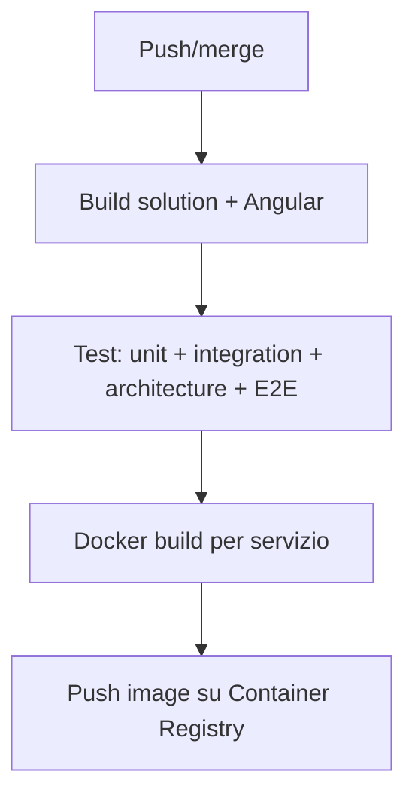

# Seaside Vertical Standalone -- Guida alla Costruzione

> Documento operativo per un **Team Verticale** che deve costruire un'applicazione business SENZA dipendere dal framework Seaside, rispettando le stesse regole architetturali.
> Derivato da: [Architecture Decision Book](ARCHITECTURE_DECISION_BOOK.md)
> Complementare a: [Framework Construction Guide](FRAMEWORK_CONSTRUCTION_GUIDE.md), [Vertical Evolution Guide](VERTICAL_EVOLUTION_GUIDE.md)
> Ultimo aggiornamento: 2026-04-01

---

## Indice

- [1. Scopo e Contesto](#1-scopo-e-contesto)
- [2. Design for Evolution](#2-design-for-evolution)
- [3. Stack Tecnologico](#3-stack-tecnologico)
- [4. Struttura del Repository](#4-struttura-del-repository)
- [5. Pattern Architetturali](#5-pattern-architetturali)
- [6. Struttura dei Moduli Business](#6-struttura-dei-moduli-business)
- [7. Persistenza e Data Access](#7-persistenza-e-data-access)
- [8. Identity, Autenticazione e Sicurezza](#8-identity-autenticazione-e-sicurezza)
- [9. Comunicazione tra Moduli](#9-comunicazione-tra-moduli)
- [10. Workers e Background Processes](#10-workers-e-background-processes)
- [11. Frontend Angular](#11-frontend-angular)
- [12. Testing](#12-testing)
- [13. Regole di Dipendenza](#13-regole-di-dipendenza)
- [14. CI/CD](#14-cicd)
- [15. Rischi](#15-rischi)

---

## 1. Scopo e Contesto

Questo documento guida la costruzione di un'applicazione verticale **autocontenuta** che rispetta tutte le decisioni architetturali del progetto Seaside ma implementa i pattern **localmente**, senza consumare pacchetti NuGet/npm dal framework.

**Quando usare questa guida:**
- Il framework Seaside non e' ancora pronto (in costruzione)
- Il verticale deve partire subito
- Si vuole rispettare fin da subito l'architettura target per facilitare l'evoluzione futura

**Differenze chiave rispetto a un verticale framework-based:**

| Aspetto | Framework-based | Standalone (questa guida) |
|---|---|---|
| Building blocks | Pacchetti NuGet dal feed privato | Progetti locali nella solution |
| Shared UI | Pacchetti npm `@seaside/*` | Librerie Angular locali |
| Repository | Multi-repo (framework + verticale) | **Singolo repo** |
| Packaging | Consume pacchetti pubblicati | Nessun feed esterno |
| Evoluzione | Gia' agganciato al framework | Predisposto per evoluzione futura |

### Principi architetturali

Gli stessi 7 principi del framework, applicati al contesto standalone:

1. **Separazione building blocks/business** -- i BB locali non contengono logica di dominio
2. **Modular monolith** -- moduli isolati composti dall'Host
3. **Worker separati dove serve** -- processi autonomi per responsabilita' isolate
4. **Coerenza imposta** -- regole verificabili con architecture tests
5. **Composizione sopra ereditarieta'** -- i moduli compongono i BB, non estendono classi base
6. **Struttura predisposta** -- namespace e struttura identici al framework per facilitare l'evoluzione
7. **Niente porting 1:1** -- ogni capability legacy viene classificata e ricostruita

> Fonte: [Architecture Decision Book](ARCHITECTURE_DECISION_BOOK.md), Cap. 1

---

## 2. Design for Evolution

> **Regola fondamentale**: la struttura del verticale standalone DEVE ricalcare quella del framework. Quando il framework sara' pronto, l'evoluzione consistera' nel sostituire i progetti locali con pacchetti NuGet/npm, senza toccare la logica business.

### Convenzioni da rispettare per l'evoluzione

1. **Namespace**: usare `Seaside.BuildingBlocks.*` per i progetti BB locali (es. `Seaside.BuildingBlocks.Abstractions`). Quando si sostituira' con il pacchetto NuGet, il namespace sara' identico.

2. **Interfacce identiche**: le interfacce nei BB locali (es. `IMediator`, `ICurrentUser`, `IMessageBus`) devono avere la **stessa firma** definita nell'ADB. Il framework implementera' le stesse interfacce.

3. **Struttura cartelle**: la cartella `src/BuildingBlocks/` deve avere la stessa struttura del framework repo.

4. **DI Registration**: usare nomi di extension method che rispecchino quelli del framework (es. `AddSeasideMediator()`, non `AddLocalMediator()`).

5. **Shared.UI**: le librerie Angular locali usano lo stesso prefisso `@seaside/*` (come scope npm locale).

La guida dettagliata per l'evoluzione e' in: [Vertical Evolution Guide](VERTICAL_EVOLUTION_GUIDE.md)

---

## 3. Stack Tecnologico

Identico al framework:

| Tecnologia | Versione | Decisione |
|---|---|---|
| Runtime backend | .NET 10 (LTS) | D-01 |
| Orchestrazione | .NET Aspire | D-02 |
| Package management | Central Package Management (`Directory.Packages.props`) | D-03 |
| Formato progetti | SDK-style | D-04 |
| Frontend | Angular 21+ | D-10 |
| Database | SQL Server | D-30 |
| ORM | Entity Framework Core | D-31 |
| Message broker | Azure Service Bus (primario) | D-58 |

> Fonte: [Architecture Decision Book](ARCHITECTURE_DECISION_BOOK.md), Cap. 3

---

## 4. Struttura del Repository

```
[NomeProdotto]/
│
├── src/
│   ├── AppHost/                                 # Aspire AppHost
│   │   ├── AppHost.csproj
│   │   └── Program.cs
│   │
│   ├── BuildingBlocks/                          # BB LOCALI (stessa struttura del framework)
│   │   ├── Abstractions/
│   │   │   └── Abstractions.csproj              # namespace: Seaside.BuildingBlocks.Abstractions
│   │   ├── Application/
│   │   │   └── Application.csproj               # namespace: Seaside.BuildingBlocks.Application
│   │   ├── Domain/
│   │   │   └── Domain.csproj                    # namespace: Seaside.BuildingBlocks.Domain
│   │   ├── Infrastructure/
│   │   │   └── Infrastructure.csproj
│   │   ├── Security/
│   │   ├── Audit/
│   │   ├── Observability/
│   │   ├── Configuration/
│   │   ├── ErrorHandling/
│   │   ├── Hooks/
│   │   ├── BackgroundJobs/
│   │   ├── FileStorage/
│   │   ├── Workspace/
│   │   ├── Messaging.AzureServiceBus/
│   │   └── Identity/
│   │
│   ├── Shared/
│   │   ├── Contracts/                           # DTO condivisi tra moduli
│   │   └── Kernel/                              # Utilities
│   │
│   ├── Hosts/
│   │   └── [NomeProdotto].Web/                  # Host web (BFF + API)
│   │       ├── [NomeProdotto].Web.csproj
│   │       ├── Program.cs
│   │       └── appsettings.json
│   │
│   ├── Modules/                                 # BUSINESS MODULES
│   │   └── [NomeModulo]/
│   │       ├── [NomeModulo].csproj
│   │       ├── Domain/
│   │       ├── Application/
│   │       ├── Infrastructure/
│   │       ├── Endpoints/
│   │       └── DependencyInjection.cs
│   │
│   ├── Workers/
│   │   ├── Scheduler.Worker/
│   │   └── [NomeWorker].Worker/
│   │
│   ├── ServiceDefaults/                         # Standard tecnici Aspire (locale)
│   │
│   └── Frontend/                                # Angular workspace
│       ├── angular.json
│       ├── package.json
│       └── src/
│           ├── app/
│           │   ├── shell/                       # Shell locale (equiv. @seaside/shell)
│           │   ├── shared/
│           │   │   ├── components/              # Componenti condivisi (equiv. @seaside/components)
│           │   │   └── theming/                 # Design tokens (equiv. @seaside/theming)
│           │   └── modules/                     # Pagine di dominio
│           └── locale/                          # File traduzioni
│
├── tests/
│   ├── UnitTests/
│   ├── IntegrationTests/
│   ├── ArchitectureTests/
│   └── E2E/
│
├── Directory.Build.props
├── Directory.Packages.props
├── global.json
├── .editorconfig
├── [NomeProdotto].sln
└── README.md
```

> Fonte: [Architecture Decision Book](ARCHITECTURE_DECISION_BOOK.md), Cap. 8.3, 8.4

---

## 5. Pattern Architetturali

### 5.1 Vertical Slices + Mediator (D-20, D-21)

Ogni use case e' una slice autonoma. Il mediator pipeline inietta cross-cutting concerns:

```
[Minimal API Endpoint]  →  [Mediator Pipeline]  →  [Business Handler]
                              ├── Validation
                              ├── Logging
                              ├── Authorization
                              ├── Audit
                              └── Error Handling
```

#### Interfacce da implementare in `BuildingBlocks/Abstractions/`

```csharp
namespace Seaside.BuildingBlocks.Abstractions;

public interface ICommand<TResponse> { }
public interface IQuery<TResponse> { }

public interface ICommandHandler<TCommand, TResponse> where TCommand : ICommand<TResponse>
{
    Task<TResponse> Handle(TCommand command, CancellationToken ct);
}

public interface IQueryHandler<TQuery, TResponse> where TQuery : IQuery<TResponse>
{
    Task<TResponse> Handle(TQuery query, CancellationToken ct);
}

public interface INotification { }
public interface INotificationHandler<TNotification> where TNotification : INotification
{
    Task Handle(TNotification notification, CancellationToken ct);
}

public interface IPipelineBehavior<TRequest, TResponse>
{
    Task<TResponse> Handle(TRequest request, RequestHandlerDelegate<TResponse> next, CancellationToken ct);
}

public interface IMediator
{
    Task<TResponse> Send<TResponse>(ICommand<TResponse> command, CancellationToken ct);
    Task<TResponse> Send<TResponse>(IQuery<TResponse> query, CancellationToken ct);
    Task Publish<TNotification>(TNotification notification, CancellationToken ct)
        where TNotification : INotification;
}
```

#### Implementazione in `BuildingBlocks/Application/`

```csharp
namespace Seaside.BuildingBlocks.Application;

public class SeasideMediator : IMediator
{
    private readonly IServiceProvider _provider;

    // ~200 righe: risolve handler + behaviors dal DI, costruisce pipeline, esegue
    public async Task<TResponse> Send<TResponse>(ICommand<TResponse> command, CancellationToken ct)
    {
        // 1. Risolve ICommandHandler<TCommand, TResponse>
        // 2. Wrappa con i IPipelineBehavior registrati
        // 3. Esegue la pipeline
    }
}
```

#### Pipeline behaviors

| Behavior | Scopo | Ordine | Progetto |
|---|---|---|---|
| `LoggingBehavior` | Log strutturato request/response | 1 | BB.Observability |
| `ValidationBehavior` | FluentValidation | 2 | BB.Application |
| `AuthorizationBehavior` | Verifica permessi | 3 | BB.Security |
| `AuditBehavior` | Audit trail (solo command) | 4 | BB.Audit |
| `ErrorHandlingBehavior` | Eccezioni -> Result\<T\> | 5 | BB.ErrorHandling |

#### Registration

```csharp
// Nel Program.cs dell'Host
builder.AddSeasideMediator(typeof(CreateOrderHandler).Assembly);
```

### 5.2 Result Types (D-22)

Implementare in `BuildingBlocks/Abstractions/`:

```csharp
namespace Seaside.BuildingBlocks.Abstractions;

public class Result<T>
{
    public bool IsSuccess { get; }
    public T Value { get; }
    public Error Error { get; }

    public static Result<T> Success(T value) => new() { ... };
    public static Result<T> Failure(Error error) => new() { ... };
    public static Result<T> NotFound() => new() { ... };
}
```

Conversione automatica in Problem Details (RFC 9457) per risposte HTTP.

### 5.3 DDD Building Blocks

Implementare in `BuildingBlocks/Domain/`:

```csharp
namespace Seaside.BuildingBlocks.Domain;

public abstract class Entity<TId> where TId : notnull
{
    public TId Id { get; protected set; }
}

public abstract class AggregateRoot<TId> : Entity<TId> where TId : notnull
{
    private readonly List<DomainEvent> _domainEvents = new();
    public IReadOnlyList<DomainEvent> DomainEvents => _domainEvents.AsReadOnly();
    protected void AddDomainEvent(DomainEvent domainEvent) => _domainEvents.Add(domainEvent);
    public void ClearDomainEvents() => _domainEvents.Clear();
}

public abstract class ValueObject
{
    protected abstract IEnumerable<object> GetEqualityComponents();
    // Equals, GetHashCode basati su GetEqualityComponents()
}

public abstract class DomainEvent : INotification
{
    public Guid Id { get; } = Guid.NewGuid();
    public DateTime OccurredOn { get; } = DateTime.UtcNow;
}
```

### 5.4 Hexagonal Architecture (D-23)

Ogni modulo business segue l'architettura esagonale con 4 layer logici (cartelle, non progetti separati):

```
                ┌─────────────────────────────┐
                │     DRIVING ADAPTERS         │
                │   (Endpoints / Minimal API)  │
                └──────────────┬──────────────┘
                               │
                ┌──────────────▼──────────────┐
                │     APPLICATION LAYER        │
                │   (Handlers / Use Cases)     │
                └──────────────┬──────────────┘
                               │
                ┌──────────────▼──────────────┐
                │     DOMAIN (centro)          │
                │   Entita', Aggregati, Ports  │
                │   ZERO dipendenze esterne    │
                └──────────────┬──────────────┘
                               │
                ┌──────────────▼──────────────┐
                │     DRIVEN ADAPTERS          │
                │   (Infrastructure)           │
                └─────────────────────────────┘
```

**Regole di dipendenza vincolanti:**

| Layer | Puo' dipendere da | NON puo' dipendere da |
|---|---|---|
| `Domain/` | Solo BB.Domain, BB.Abstractions | Application, Infrastructure, Endpoints |
| `Application/` | Domain/, BB.Application, BB.Abstractions | Infrastructure, Endpoints |
| `Infrastructure/` | Domain/, Application/, BB.Infrastructure, pacchetti esterni | Endpoints |
| `Endpoints/` | Application/ (via mediator), BB.Abstractions | Domain, Infrastructure |

Verificate da architecture tests (Cap. 12).

> Fonte: [Architecture Decision Book](ARCHITECTURE_DECISION_BOOK.md), Cap. 5

---

## 6. Struttura dei Moduli Business

### 6.1 Layout Interno

```
Modules/
  └── Orders/
      ├── Orders.csproj
      ├── Domain/
      │   ├── Entities/
      │   │   ├── Order.cs               # Aggregate Root
      │   │   └── OrderLine.cs           # Entity child
      │   ├── ValueObjects/
      │   │   └── Money.cs
      │   ├── Events/
      │   │   └── OrderCreatedEvent.cs   # Domain Event
      │   ├── Errors/
      │   │   └── OrderErrors.cs
      │   └── Abstractions/
      │       └── IOrderRepository.cs    # Port
      ├── Application/
      │   ├── CreateOrder/
      │   │   ├── CreateOrderCommand.cs
      │   │   ├── CreateOrderHandler.cs
      │   │   └── CreateOrderValidator.cs
      │   ├── GetOrder/
      │   │   ├── GetOrderQuery.cs
      │   │   ├── GetOrderHandler.cs
      │   │   └── GetOrderResponse.cs
      │   └── EventHandlers/
      │       └── OrderCreatedEventHandler.cs
      ├── Infrastructure/
      │   ├── OrdersDbContext.cs
      │   ├── Configurations/
      │   │   └── OrderConfiguration.cs  # EF mapping
      │   ├── Repositories/
      │   │   └── OrderRepository.cs     # Driven Adapter
      │   └── IntegrationEvents/
      │       └── OrderUpdatedIntegrationEvent.cs
      ├── Endpoints/
      │   └── OrderEndpoints.cs          # Minimal API sottilissimi
      └── DependencyInjection.cs
```

### 6.2 Composizione Host

```csharp
// Hosts/[NomeProdotto].Web/Program.cs
builder.AddServiceDefaults();
builder.AddSeasideMediator(
    typeof(Orders.DependencyInjection).Assembly,
    typeof(Inventory.DependencyInjection).Assembly);
builder.AddModuleOrders();
builder.AddModuleInventory();
```

### 6.3 Regole di Isolamento

- Un modulo non accede al DbContext di un altro modulo
- Comunicazione tra moduli via integration events o shared contracts
- Le migrazioni di un modulo non toccano tabelle di altri moduli

> Fonte: [Architecture Decision Book](ARCHITECTURE_DECISION_BOOK.md), Cap. 11

---

## 7. Persistenza e Data Access

### 7.1 DbContext per Modulo (D-32)

Ogni modulo ha il proprio DbContext. Implementare nel BB locale `Infrastructure` una base class opzionale.

Un DbContext separato per le entita' di piattaforma (utenti, audit, configurazione).

### 7.2 Repository Pattern (D-34)

```csharp
// Domain/Abstractions/ -- Port
public interface IOrderRepository
{
    Task<Order?> GetByIdAsync(OrderId id, CancellationToken ct);
    Task AddAsync(Order order, CancellationToken ct);
}

// Infrastructure/ -- Driven Adapter
public class OrderRepository : IOrderRepository
{
    private readonly OrdersDbContext _db;
    public async Task<Order?> GetByIdAsync(OrderId id, CancellationToken ct)
        => await _db.Orders.FindAsync([id], ct);
    public async Task AddAsync(Order order, CancellationToken ct)
        => await _db.Orders.AddAsync(order, ct);
}
```

### 7.3 EF Migrations per Modulo (D-33)

Ogni DbContext ha le proprie migrazioni. Al deploy EF applica automaticamente.

### 7.4 Connection String Strategy (D-37)

Mai hardcodate. Aspire inietta in dev, env var in prod:

```csharp
// AppHost/Program.cs
IResourceBuilder<IResourceWithConnectionString> sql;
if (builder.ExecutionContext.IsPublishMode)
    sql = builder.AddConnectionString("appdb");
else
    sql = builder.AddSqlServer("sql").AddDatabase("appdb");

var api = builder.AddProject<Projects.NomeProdotto_Web>("web")
    .WithReference(sql).WaitFor(sql);
```

```csharp
// Host Program.cs
builder.Services.AddDbContext<OrdersDbContext>(options =>
    options.UseSqlServer(builder.Configuration.GetConnectionString("appdb")));
```

### 7.5 CQRS Leggero (D-35)

Non mandatorio. Il framework fornisce `ICommand<T>` e `IQuery<T>`. Le query possono usare un read-only port (`IOrderReadModel`).

> Fonte: [Architecture Decision Book](ARCHITECTURE_DECISION_BOOK.md), Cap. 6

---

## 8. Identity, Autenticazione e Sicurezza

### 8.1 BFF Pattern (D-44)

Il frontend Angular comunica solo con l'Host .NET. JWT mai esposto al browser. httpOnly secure cookie.

```
Browser → httpOnly cookie → Host (BFF + API stesso processo)
    → Cookie Middleware → ClaimsPrincipal → ICurrentUser → handler
```

### 8.2 Provider Auth (D-40, D-41)

7 provider supportati: AAD, B2C, Google, SAML2, custom forms, Teams, PBI.

Ogni provider e' un `AuthenticationScheme` ASP.NET Core. Implementare nel BB locale `Security` e `Identity`:

| Provider | Scheme | Pacchetto |
|---|---|---|
| Custom forms | `JwtBearerDefaults` | Built-in |
| Azure AD | `OpenIdConnectDefaults` | `Microsoft.Identity.Web` |
| Azure AD B2C | `OpenIdConnectDefaults` (separata) | `Microsoft.Identity.Web` |
| Google | `GoogleDefaults` | `Microsoft.AspNetCore.Authentication.Google` |
| SAML2 | `Saml2Defaults` | `Sustainsys.Saml2.AspNetCore2` |
| Teams | Custom | Custom locale |
| Power BI | Custom | Custom locale |

### 8.3 Autorizzazione (D-42)

RBAC permission-based + workspace scoping (opt-in):

```csharp
// Implementare in BB locale Security
public interface IPermissionChecker
{
    Task<bool> HasPermissionAsync(string permission, CancellationToken ct);
}

// Implementare in BB locale Workspace (opt-in)
public interface IWorkspaceContext
{
    Guid? CurrentWorkspaceId { get; }
    bool HasWorkspace { get; }
}

public interface IWorkspaceScopedEntity
{
    Guid WorkspaceId { get; }
}
```

### 8.4 Session Management (D-45)

Sessioni server-side. Redis (prod), in-memory (dev). Parametri configurabili:

| Parametro | Default |
|---|---|
| IdleTimeout | 30 min |
| SlidingExpiration | true |
| MaxSessionDuration | 8 ore |

### 8.5 Security Hardening (D-47)

Implementare nel BB locale `Security`:

- **CORS**: configurabile
- **CSP**: `default-src 'self'`, estendibile
- **Rate limiting**: globale + auth anti brute-force
- **Anti-forgery**: `X-XSRF-TOKEN`
- **HtmlSanitizer**: per rich text
- **Security headers**: nosniff, DENY, HSTS

### 8.6 Secrets Management (D-46)

| Ambiente | Strategia |
|---|---|
| Development | User Secrets + Aspire |
| Produzione Azure | Azure Key Vault |
| Produzione non-Azure | Environment variables |

> Fonte: [Architecture Decision Book](ARCHITECTURE_DECISION_BOOK.md), Cap. 7

---

## 9. Comunicazione tra Moduli

### 9.1 Principi (D-56, D-57)

- **Eventual consistency**: i moduli non si aspettano reazioni sincrone
- **Integration Events**: comunicazione cross-modulo via message broker
- **Nessuna dipendenza diretta** tra moduli

### 9.2 IMessageBus (D-58)

Implementare in BB locale `Abstractions`:

```csharp
namespace Seaside.BuildingBlocks.Abstractions;

public interface IMessageBus
{
    Task PublishAsync<T>(T message, CancellationToken ct) where T : IIntegrationEvent;
    Task SubscribeAsync<T>(Func<T, CancellationToken, Task> handler, CancellationToken ct) where T : IIntegrationEvent;
    Task ScheduleAsync<T>(T message, DateTimeOffset scheduledTime, CancellationToken ct) where T : IIntegrationEvent;
    Task DeadLetterAsync(string messageId, string reason, CancellationToken ct);
}
```

Adapter in `Messaging.AzureServiceBus/`.

### 9.3 Outbox/Inbox (D-59)

**Outbox**: evento in tabella `[Modulo]_OutboxMessages` nella stessa transazione del SaveChanges. `OutboxRelay` background service pubblica sul broker.

**Inbox**: verifica `MessageId` per idempotenza.

```
Tabelle per modulo:

[NomeModulo]_OutboxMessages
├── Id, EventType, Payload, CreatedAt, ProcessedAt, Error

[NomeModulo]_InboxMessages
├── Id, MessageId, EventType, ProcessedAt
```

### 9.4 Shared Contracts

DTO condivisi per i payload degli eventi:

```
src/
  ├── Shared/Contracts/
  │   ├── Orders/
  │   │   └── OrderCreatedEvent.cs
  │   └── Inventory/
  │       └── InventoryReservedEvent.cs
```

### 9.5 Saga (Choreography-Based)

Niente orchestratore centrale. Ogni modulo implementa compensating transactions. `CorrelationId` automatico in `IIntegrationEvent`.

### 9.6 Caching

| Livello | Tecnologia | Quando |
|---|---|---|
| In-memory | `IMemoryCache` | Giorno 1 |
| Distributed | Redis via `IDistributedCache` | Fase successiva |

> Fonte: [Architecture Decision Book](ARCHITECTURE_DECISION_BOOK.md), Cap. 8.8

---

## 10. Workers e Background Processes

### 10.1 Pattern Standard (D-70)

`BackgroundService` nativo .NET. Implementare astrazioni base in `BuildingBlocks/BackgroundJobs/`.

### 10.2 Scheduling (D-71)

Scheduler.Worker separato pubblica job sul broker. I worker ascoltano le code:

```
Scheduler.Worker ──[IMessageBus]──► Message Broker ──► Worker Services
```

Cron expressions via [Cronos](https://github.com/HangfireIO/Cronos) (MIT, zero dipendenze).

```json
{
  "Schedules": [
    { "Name": "daily-import", "Cron": "0 2 * * *", "Queue": "jobs.import" },
    { "Name": "hourly-sync", "Cron": "0 * * * *", "Queue": "jobs.sync" }
  ]
}
```

### 10.3 Aspire Integration

```csharp
// AppHost
var scheduler = builder.AddProject<Projects.Scheduler_Worker>("scheduler")
    .WithReference(messaging);
var importWorker = builder.AddProject<Projects.Import_Worker>("import-worker")
    .WithReference(messaging).WithReference(sql);
```

> Fonte: [Architecture Decision Book](ARCHITECTURE_DECISION_BOOK.md), Cap. 12

---

## 11. Frontend Angular

### 11.1 Shell Applicativa

Costruire localmente in `src/app/shell/` con lo stesso design del framework:
- Header con branding, utente corrente, notifiche
- Sidebar 240px/48px collassabile
- Content area
- Workspace selector (se workspace attivo)

### 11.2 Theming e Design Tokens (D-12)

Design tokens CSS custom properties a due livelli:

```scss
// src/app/shared/theming/_foundation.scss -- non sovrascrivibili
:root {
  --seaside-spacing-xs: 4px;
  --seaside-spacing-sm: 8px;
  --seaside-spacing-md: 16px;
  --seaside-font-size-body: 14px;
  --seaside-radius-md: 6px;
}

// src/app/shared/theming/_theme.scss -- personalizzabili
:root {
  --seaside-color-primary: #2E7BAF;
  --seaside-color-accent: #AF7B2E;
  --seaside-density: default;
}
```

### 11.3 Component Library (D-11)

ng-zorro-antd baseline. Wrappare in componenti `<app-data-grid>`, `<app-form>`, etc. con API unificate, pronti per rinomina in `<seaside-*>` durante l'evoluzione.

### 11.4 Accessibilita' (WCAG 2.1 AA)

4 livelli di enforcement:
1. Componenti a11y by design (ARIA, keyboard nav, focus management)
2. `@angular-eslint` a11y rules come errori
3. axe-core in CI
4. Lighthouse CI

### 11.5 State Management

Servizi Angular con Signals. Nessuna libreria esterna.

### 11.6 i18n

`@angular/localize`. Build-time extraction, ICU format. RTL supportato.

### 11.7 SSR e Performance

Angular SSR con hydration. Lazy loading per route. Core Web Vitals: LCP < 2.5s, INP < 200ms, CLS < 0.1.

> Fonte: [Architecture Decision Book](ARCHITECTURE_DECISION_BOOK.md), Cap. 4, 10

---

## 12. Testing

### 12.1 Stack

| Tipo | Tool | Dove |
|---|---|---|
| Unit (backend) | xUnit + FluentAssertions + Bogus | tests/UnitTests/ |
| Integration | Testcontainers (SQL Server) | tests/IntegrationTests/ |
| Architecture | NetArchTest | tests/ArchitectureTests/ |
| Unit (frontend) | Jest | Frontend/src/ |
| E2E | Playwright | tests/E2E/ |
| a11y | axe-core (jest-axe + @axe-core/playwright) | tests/E2E/tests/a11y/ |
| Performance | Playwright + k6 | tests/E2E/tests/performance/ |

### 12.2 Architecture Tests

Verificano le stesse regole del framework, applicate ai progetti locali:

```csharp
[Fact]
public void Domain_Should_Not_Depend_On_Infrastructure()
{
    var result = Types.InNamespace("Orders.Domain")
        .ShouldNot()
        .HaveDependencyOn("Orders.Infrastructure")
        .GetResult();
    result.IsSuccessful.Should().BeTrue();
}

[Fact]
public void Modules_Should_Not_Depend_On_Other_Modules()
{
    var result = Types.InNamespace("Orders")
        .ShouldNot()
        .HaveDependencyOn("Inventory")
        .GetResult();
    result.IsSuccessful.Should().BeTrue();
}
```

### 12.3 E2E con Playwright

```
tests/E2E/
  ├── playwright.config.ts
  ├── fixtures/
  │   └── auth.fixture.ts
  ├── pages/                     # Page Object Model
  ├── tests/
  │   ├── smoke/
  │   ├── e2e/
  │   ├── a11y/
  │   └── visual/
  └── k6/                        # Load testing
```

> Fonte: [Architecture Decision Book](ARCHITECTURE_DECISION_BOOK.md), Cap. 13

---

## 13. Regole di Dipendenza

### 13.1 Inter-Progetto

| Progetto sorgente | Puo' dipendere da |
|---|---|
| AppHost | Tutti (orchestrazione) |
| Hosts | Modules, BuildingBlocks locali, Shared, ServiceDefaults |
| Workers | Modules, BuildingBlocks locali, ServiceDefaults |
| Modules | BuildingBlocks locali, Shared.Contracts |
| BuildingBlocks | Solo altri BB e pacchetti NuGet esterni |
| ServiceDefaults | Solo pacchetti Aspire/OpenTelemetry |

### 13.2 Divieti

| Divieto | Motivazione |
|---|---|
| BuildingBlocks -> Modules | I BB non conoscono i moduli |
| Modules -> Hosts | I moduli non conoscono chi li ospita |
| Modules -> altri Modules | Nessun coupling diretto |
| Workers -> Frontend | I worker non hanno UI |

### 13.3 Intra-Modulo (Hexagonal)

| Layer | Puo' dipendere da | NON puo' dipendere da |
|---|---|---|
| Domain/ | BB.Domain, BB.Abstractions | Application, Infrastructure, Endpoints |
| Application/ | Domain/, BB.Application, BB.Abstractions | Infrastructure, Endpoints |
| Infrastructure/ | Domain/, Application/, BB.Infrastructure | Endpoints |
| Endpoints/ | Application/ (via mediator), BB.Abstractions | Domain, Infrastructure |

Tutte verificate da architecture tests.

> Fonte: [Architecture Decision Book](ARCHITECTURE_DECISION_BOOK.md), Cap. 8.7

---

## 14. CI/CD

### 14.1 Modello di Deployment (D-55)

Multi-container su Azure Container Apps:

| Container | Contenuto |
|---|---|
| **Frontend** | Angular build servita da nginx |
| **API Host** | ASP.NET Core + moduli business |
| **Worker N** | BackgroundService per responsabilita' specifiche |

Database: Azure SQL Database **esterno** ai container.

### 14.2 Pipeline



Nessuna pubblicazione di pacchetti NuGet/npm (tutto e' locale).

### 14.3 AppHost Aspire

```csharp
// Development: tutto locale
var sql = builder.AddSqlServer("sql").AddDatabase("appdb");
var messaging = builder.AddAzureServiceBus("messaging");

var api = builder.AddProject<Projects.NomeProdotto_Web>("web")
    .WithReference(sql).WithReference(messaging);

builder.AddNpmApp("frontend", "../Frontend")
    .WithReference(api).WithHttpEndpoint(env: "PORT");
```

> Fonte: [Architecture Decision Book](ARCHITECTURE_DECISION_BOOK.md), Cap. 8.11

---

## 15. Rischi

| # | Rischio | Mitigazione |
|---|---|---|
| R1 | BB locali divergono dal framework | Rispettare namespace e interfacce dell'ADB |
| R2 | Over-engineering nei BB | YAGNI: implementare solo cio' che serve |
| R3 | Dipendenze incrociate tra moduli | Architecture tests + integration events |
| R4 | Evoluzione verso il framework complessa | Seguire le convenzioni di questo documento |
| R5 | Curva di apprendimento pattern | Documentazione, modulo di esempio |

> Per l'evoluzione verso il framework: [Vertical Evolution Guide](VERTICAL_EVOLUTION_GUIDE.md)
