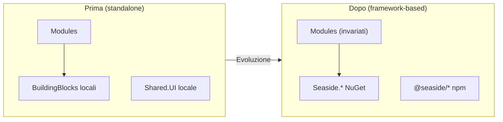
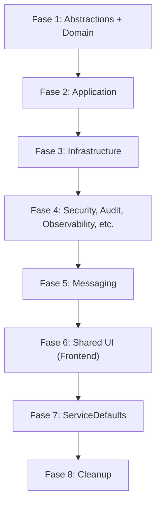

# Seaside Vertical -- Guida all'Evoluzione verso il Framework

> Guida passo-passo per evolvere un verticale standalone (costruito con la [Standalone Vertical Guide](STANDALONE_VERTICAL_GUIDE.md)) verso il consumo dei pacchetti Seaside framework (NuGet + npm).
> Fonte di verita': [Architecture Decision Book](ARCHITECTURE_DECISION_BOOK.md)
> Prerequisito: [Standalone Vertical Guide](STANDALONE_VERTICAL_GUIDE.md)
> Ultimo aggiornamento: 2026-04-01

---

## Indice

- [1. Principio Fondamentale](#1-principio-fondamentale)
- [2. Prerequisiti](#2-prerequisiti)
- [3. Mapping Completo](#3-mapping-completo)
- [4. Setup Infrastrutturale](#4-setup-infrastrutturale)
- [5. Processo di Migrazione](#5-processo-di-migrazione)
- [6. Modifiche al DI Registration](#6-modifiche-al-di-registration)
- [7. Cosa Rimane Invariato](#7-cosa-rimane-invariato)
- [8. Cosa Viene Eliminato](#8-cosa-viene-eliminato)
- [9. Modifiche ai Test](#9-modifiche-ai-test)
- [10. Modifiche CI/CD](#10-modifiche-cicd)
- [11. Checklist di Verifica](#11-checklist-di-verifica)
- [12. Strategia di Rollback](#12-strategia-di-rollback)
- [13. Troubleshooting](#13-troubleshooting)

---

## 1. Principio Fondamentale

> L'evoluzione **NON deve cambiare il comportamento business**. La logica applicativa (Modules) resta intatta. Cambia solo l'infrastruttura sottostante: i building blocks locali vengono sostituiti da pacchetti framework compilati.

Se il verticale standalone e' stato costruito seguendo la [Standalone Vertical Guide](STANDALONE_VERTICAL_GUIDE.md) con le convenzioni di namespace e interfacce corrette, la migrazione consiste in:

1. Aggiungere i pacchetti NuGet/npm del framework
2. Rimuovere i progetti locali equivalenti
3. Aggiornare le registrazioni DI (se necessario)
4. Verificare che tutto compili e i test passino



---

## 2. Prerequisiti

Prima di iniziare la migrazione, verificare:

- [ ] I pacchetti framework Seaside sono **pubblicati** sul feed NuGet privato
- [ ] I pacchetti npm `@seaside/*` sono **pubblicati** sul registry npm privato
- [ ] Si ha **accesso** ai feed (credenziali, token)
- [ ] Il verticale e' stato costruito seguendo la [Standalone Vertical Guide](STANDALONE_VERTICAL_GUIDE.md)
- [ ] I namespace dei BB locali sono `Seaside.BuildingBlocks.*` (allineati al framework)
- [ ] Le interfacce dei BB locali hanno le **stesse firme** del framework
- [ ] Si lavora su un **feature branch** (mai sul main direttamente)
- [ ] Tutti i test passano sul branch corrente (baseline verde)

---

## 3. Mapping Completo

### 3.1 Backend -- Progetto Locale -> Pacchetto NuGet

| Progetto locale | Pacchetto NuGet framework | Contenuto |
|---|---|---|
| `src/BuildingBlocks/Abstractions/` | `Seaside.BuildingBlocks.Abstractions` | IEntity, ICurrentUser, Result\<T\>, IMessageBus |
| `src/BuildingBlocks/Application/` | `Seaside.BuildingBlocks.Application` | SeasideMediator, pipeline behaviors, CQRS types |
| `src/BuildingBlocks/Domain/` | `Seaside.BuildingBlocks.Domain` | Entity\<TId\>, AggregateRoot, ValueObject, DomainEvent |
| `src/BuildingBlocks/Infrastructure/` | `Seaside.BuildingBlocks.Infrastructure` | EF Core base, repository base, interceptors |
| `src/BuildingBlocks/Security/` | `Seaside.BuildingBlocks.Security` | Auth middleware, RBAC, BFF, CSP, HtmlSanitizer |
| `src/BuildingBlocks/Identity/` | `Seaside.BuildingBlocks.Identity` | Multi-provider login |
| `src/BuildingBlocks/Users/` | `Seaside.BuildingBlocks.Users` | User, Role, Permission, Group |
| `src/BuildingBlocks/Audit/` | `Seaside.BuildingBlocks.Audit` | AuditInterceptor, IAuditLogger |
| `src/BuildingBlocks/Observability/` | `Seaside.BuildingBlocks.Observability` | Logging, Metrics, Tracing |
| `src/BuildingBlocks/Configuration/` | `Seaside.BuildingBlocks.Configuration` | IModuleConfiguration |
| `src/BuildingBlocks/BackgroundJobs/` | `Seaside.BuildingBlocks.BackgroundJobs` | IBackgroundJob, IScheduledJob |
| `src/BuildingBlocks/ErrorHandling/` | `Seaside.BuildingBlocks.ErrorHandling` | Problem Details, error mapping |
| `src/BuildingBlocks/Hooks/` | `Seaside.BuildingBlocks.Hooks` | IPreSaveHook\<T\>, IPostSaveHook\<T\>, etc. |
| `src/BuildingBlocks/FileStorage/` | `Seaside.BuildingBlocks.FileStorage` | IFileStorageService |
| `src/BuildingBlocks/HierarchicalEntities/` | `Seaside.BuildingBlocks.HierarchicalEntities` | HierarchicalEntity\<TId\>, tree queries |
| `src/BuildingBlocks/StateMachine/` | `Seaside.BuildingBlocks.StateMachine` | IStatefulEntity\<TState\>, transitions, guards |
| `src/BuildingBlocks/Workspace/` | `Seaside.BuildingBlocks.Workspace` | IWorkspaceContext, IWorkspaceScopedEntity |
| `src/BuildingBlocks/Messaging.AzureServiceBus/` | `Seaside.BuildingBlocks.Messaging.AzureServiceBus` | Adapter Azure SB, Outbox/Inbox |
| `src/Shared/Contracts/` | `Seaside.Shared.Contracts` | DTO condivisi |
| `src/Shared/Kernel/` | `Seaside.Shared.Kernel` | Utilities |
| `src/ServiceDefaults/` | `Seaside.ServiceDefaults` | OpenTelemetry, health checks, Polly |

**Meta-pacchetto**: in alternativa ai singoli riferimenti, e' disponibile `Seaside.BuildingBlocks.All` che include tutto come dipendenza transitiva.

### 3.2 Frontend -- Libreria Locale -> Pacchetto npm

| Libreria locale | Pacchetto npm framework | Contenuto |
|---|---|---|
| `src/Frontend/src/app/shell/` | `@seaside/shell` | Shell applicativa (layout, nav, sidebar) |
| `src/Frontend/src/app/shared/components/` | `@seaside/components` | Componenti UI condivisi (SeasideDataGrid, SeasideForm, etc.) |
| `src/Frontend/src/app/shared/theming/` | `@seaside/theming` | Design tokens, temi, presets |

---

## 4. Setup Infrastrutturale

### 4.1 Feed NuGet

Creare `nuget.config` nella root del repo:

```xml
<?xml version="1.0" encoding="utf-8"?>
<configuration>
  <packageSources>
    <clear />
    <add key="nuget.org" value="https://api.nuget.org/v3/index.json" />
    <add key="seaside" value="https://pkgs.dev.azure.com/ORGNAME/_packaging/seaside/nuget/v3/index.json" />
  </packageSources>
  <packageSourceCredentials>
    <seaside>
      <add key="Username" value="AZURE_ARTIFACTS_USERNAME" />
      <add key="ClearTextPassword" value="%AZURE_ARTIFACTS_PAT%" />
    </seaside>
  </packageSourceCredentials>
</configuration>
```

### 4.2 Registry npm

Creare `.npmrc` nella root del workspace Angular:

```ini
@seaside:registry=https://pkgs.dev.azure.com/ORGNAME/_packaging/seaside/npm/registry/
//pkgs.dev.azure.com/ORGNAME/_packaging/seaside/npm/registry/:_authToken=${NPM_TOKEN}
```

### 4.3 Directory.Packages.props

Aggiungere i pacchetti Seaside:

```xml
<ItemGroup Label="Seaside Framework">
  <PackageVersion Include="Seaside.BuildingBlocks.Abstractions" Version="1.0.0" />
  <PackageVersion Include="Seaside.BuildingBlocks.Application" Version="1.0.0" />
  <PackageVersion Include="Seaside.BuildingBlocks.Domain" Version="1.0.0" />
  <PackageVersion Include="Seaside.BuildingBlocks.Infrastructure" Version="1.0.0" />
  <PackageVersion Include="Seaside.BuildingBlocks.Security" Version="1.0.0" />
  <PackageVersion Include="Seaside.BuildingBlocks.Identity" Version="1.0.0" />
  <PackageVersion Include="Seaside.BuildingBlocks.Users" Version="1.0.0" />
  <PackageVersion Include="Seaside.BuildingBlocks.Audit" Version="1.0.0" />
  <PackageVersion Include="Seaside.BuildingBlocks.Observability" Version="1.0.0" />
  <PackageVersion Include="Seaside.BuildingBlocks.Configuration" Version="1.0.0" />
  <PackageVersion Include="Seaside.BuildingBlocks.BackgroundJobs" Version="1.0.0" />
  <PackageVersion Include="Seaside.BuildingBlocks.ErrorHandling" Version="1.0.0" />
  <PackageVersion Include="Seaside.BuildingBlocks.Hooks" Version="1.0.0" />
  <PackageVersion Include="Seaside.BuildingBlocks.FileStorage" Version="1.0.0" />
  <PackageVersion Include="Seaside.BuildingBlocks.Workspace" Version="1.0.0" />
  <PackageVersion Include="Seaside.BuildingBlocks.Messaging.AzureServiceBus" Version="1.0.0" />
  <PackageVersion Include="Seaside.Shared.Contracts" Version="1.0.0" />
  <PackageVersion Include="Seaside.Shared.Kernel" Version="1.0.0" />
  <PackageVersion Include="Seaside.ServiceDefaults" Version="1.0.0" />
</ItemGroup>
```

### 4.4 package.json Frontend

```json
{
  "dependencies": {
    "@seaside/shell": "^1.0.0",
    "@seaside/components": "^1.0.0",
    "@seaside/theming": "^1.0.0"
  }
}
```

---

## 5. Processo di Migrazione

L'ordine e' determinato dalle dipendenze tra building blocks. Ogni fase termina con **build + test verdi**.



**Regola**: un commit tra ogni fase. Se una fase fallisce, revert del commit.

---

### Fase 1: Abstractions + Domain

Queste sono le foglie del grafo delle dipendenze. Zero rischio di cascata.

**Passi:**

1. Nei `.csproj` dei Modules, sostituire i `ProjectReference` ai BB locali con `PackageReference`:

```xml
<!-- PRIMA -->
<ProjectReference Include="..\..\BuildingBlocks\Abstractions\Abstractions.csproj" />
<ProjectReference Include="..\..\BuildingBlocks\Domain\Domain.csproj" />

<!-- DOPO -->
<PackageReference Include="Seaside.BuildingBlocks.Abstractions" />
<PackageReference Include="Seaside.BuildingBlocks.Domain" />
```

2. Rimuovere i progetti locali `Abstractions.csproj` e `Domain.csproj` dalla solution
3. Eliminare le cartelle `src/BuildingBlocks/Abstractions/` e `src/BuildingBlocks/Domain/`
4. Build: se i namespace sono allineati (`Seaside.BuildingBlocks.Abstractions`), **zero cambi nel codice dei Modules**
5. Run test: tutti devono passare

**Commit**: `refactor: replace local Abstractions + Domain with Seaside NuGet packages`

---

### Fase 2: Application

Contiene il mediator e i pipeline behaviors.

**Passi:**

1. Sostituire `ProjectReference` con `PackageReference` in tutti i `.csproj` che referenziavano Application locale
2. Rimuovere il progetto e la cartella locale
3. Aggiornare DI registration se i nomi dei metodi sono diversi (vedi [Cap. 6](#6-modifiche-al-di-registration))
4. Build + test

**Attenzione**: se il verticale ha registrato pipeline behaviors custom, verificare che la registrazione sia compatibile con il framework.

**Commit**: `refactor: replace local Application with Seaside.BuildingBlocks.Application`

---

### Fase 3: Infrastructure

Contiene EF Core base, repository base, interceptors.

**Passi:**

1. Sostituire `ProjectReference` con `PackageReference`
2. Rimuovere progetto e cartella locale
3. Verificare: DbContext base class, SaveChangesInterceptor, AuditInterceptor
4. Build + test

**Attenzione**: verificare che non ci siano interceptor duplicati (locali + framework). Rimuovere quelli locali se il framework li fornisce.

**Commit**: `refactor: replace local Infrastructure with Seaside.BuildingBlocks.Infrastructure`

---

### Fase 4: Security, Audit, Observability, Configuration, ErrorHandling, Hooks, FileStorage, Workspace, BackgroundJobs

Questi BB sono relativamente indipendenti tra loro. Possono essere migrati in batch o uno alla volta.

**Per ciascuno:**

1. Sostituire `ProjectReference` con `PackageReference`
2. Rimuovere progetto e cartella locale
3. Aggiornare DI registration
4. Build + test

**Ordine consigliato** (per minimizzare dipendenze):
1. ErrorHandling
2. Hooks
3. Configuration
4. Observability
5. Audit
6. Security
7. FileStorage
8. Workspace
9. BackgroundJobs
10. Identity + Users

**Commit per ogni batch o singolo BB**.

---

### Fase 5: Messaging

Sostituisce l'adapter locale del message broker.

**Passi:**

1. Sostituire `ProjectReference` con `PackageReference` per `Seaside.BuildingBlocks.Messaging.AzureServiceBus`
2. Rimuovere progetto e cartella locale
3. Verificare: OutboxRelay, InboxFilter, IMessageBus adapter
4. Verificare: le tabelle Outbox/Inbox hanno lo stesso schema atteso dal framework
5. Build + test

**Commit**: `refactor: replace local Messaging with Seaside.BuildingBlocks.Messaging.AzureServiceBus`

---

### Fase 6: Shared UI (Frontend)

Sostituisce le librerie Angular locali con i pacchetti npm del framework.

**Passi:**

1. Aggiungere le dipendenze npm:
```bash
npm install @seaside/shell @seaside/components @seaside/theming
```

2. Aggiornare gli import nel codice Angular:
```typescript
// PRIMA
import { ShellComponent } from '../shell/shell.component';
import { DataGridComponent } from '../shared/components/data-grid/data-grid.component';

// DOPO
import { SeasideShellComponent } from '@seaside/shell';
import { SeasideDataGridComponent } from '@seaside/components';
```

3. Aggiornare i selettori nei template:
```html
<!-- PRIMA -->
<app-shell [navItems]="navItems">
  <app-data-grid [dataSource]="data" [columns]="columns" />
</app-shell>

<!-- DOPO -->
<seaside-shell [navItems]="navItems">
  <seaside-data-grid [dataSource]="data" [columns]="columns" />
</seaside-shell>
```

4. Aggiornare gli import SCSS:
```scss
// PRIMA
@use '../shared/theming/foundation' as foundation;
@use '../shared/theming/theme' as theme;

// DOPO
@use '@seaside/theming/tokens/foundation' as foundation;
@use '@seaside/theming/tokens/theme-contract' as theme;
```

5. Rimuovere le cartelle locali: `src/app/shell/`, `src/app/shared/components/`, `src/app/shared/theming/`
6. Build Angular + test E2E

**Commit**: `refactor: replace local Shared.UI with @seaside/* npm packages`

---

### Fase 7: ServiceDefaults

**Passi:**

1. Sostituire `ProjectReference` con `PackageReference` per `Seaside.ServiceDefaults`
2. Rimuovere progetto e cartella `src/ServiceDefaults/`
3. Verificare: health checks, OpenTelemetry, Polly
4. Build + test

**Commit**: `refactor: replace local ServiceDefaults with Seaside.ServiceDefaults`

---

### Fase 8: Cleanup

1. Rimuovere la cartella `src/BuildingBlocks/` (dovrebbe essere vuota)
2. Rimuovere `src/Shared/Contracts/` e `src/Shared/Kernel/` se sostituiti da NuGet
3. Aggiornare il file `.sln` (rimuovere riferimenti ai progetti eliminati)
4. Rimuovere eventuali `Directory.Build.props` specifici dei BB locali
5. Build finale + test completi

**Commit**: `chore: cleanup removed local projects`

---

## 6. Modifiche al DI Registration

Se i nomi degli extension method sono stati allineati (come indicato nella Standalone Guide), le modifiche sono minime:

```csharp
// PRIMA (standalone) -- se era gia' allineato, nessun cambio
builder.AddSeasideMediator(typeof(CreateOrderHandler).Assembly);
builder.AddSeasideAudit();
builder.AddSeasideSecurity();
builder.AddServiceDefaults();

// DOPO (framework) -- identico se i nomi erano allineati
builder.AddSeasideMediator(typeof(CreateOrderHandler).Assembly);
builder.AddSeasideAudit();
builder.AddSeasideSecurity();
builder.AddServiceDefaults();
```

**Se i nomi NON erano allineati**, aggiornare le chiamate:

```csharp
// PRIMA (nomi non allineati)
builder.Services.AddLocalMediator(typeof(CreateOrderHandler).Assembly);
builder.Services.AddLocalAudit();

// DOPO (nomi framework)
builder.AddSeasideMediator(typeof(CreateOrderHandler).Assembly);
builder.AddSeasideAudit();
```

---

## 7. Cosa Rimane Invariato

| Area | Dettaglio |
|---|---|
| `src/Modules/` | **Tutta la logica business** -- handler, validator, entita', aggregati, domain events, endpoints |
| `src/Hosts/Program.cs` | Cambia solo le chiamate DI (se necessario) |
| `src/Workers/` | Invariati |
| `src/AppHost/` | Invariato |
| `src/Frontend/src/app/modules/` | Pagine e componenti di dominio invariati |
| Domain layer | Entita', aggregati, value objects, domain events -- zero cambi |
| Application layer | Handler, validator -- zero cambi |
| Infrastructure layer | DbContext, repository, configurations -- zero cambi |
| Endpoints | Minimal API -- zero cambi |

**Regola**: se l'evoluzione richiede di modificare la logica business, qualcosa e' andato storto.

---

## 8. Cosa Viene Eliminato

| Cartella/File | Motivazione |
|---|---|
| `src/BuildingBlocks/` (intera cartella) | Sostituita da pacchetti NuGet |
| `src/ServiceDefaults/` | Sostituito da `Seaside.ServiceDefaults` NuGet |
| `src/Shared/Contracts/` | Sostituito da `Seaside.Shared.Contracts` NuGet (se il framework lo fornisce) |
| `src/Shared/Kernel/` | Sostituito da `Seaside.Shared.Kernel` NuGet (se il framework lo fornisce) |
| `src/Frontend/src/app/shell/` | Sostituito da `@seaside/shell` |
| `src/Frontend/src/app/shared/components/` | Sostituito da `@seaside/components` |
| `src/Frontend/src/app/shared/theming/` | Sostituito da `@seaside/theming` |

> **Nota**: se `Shared/Contracts/` contiene DTO specifici del verticale (non del framework), mantenerli come progetto locale.

---

## 9. Modifiche ai Test

### 9.1 Architecture Tests

Le regole restano le stesse, ma i namespace dei BB ora vengono dal framework:

```csharp
// Le regole intra-modulo restano identiche (verificano namespace del modulo)
[Fact]
public void Domain_Should_Not_Depend_On_Infrastructure()
{
    var result = Types.InNamespace("Orders.Domain")
        .ShouldNot()
        .HaveDependencyOn("Orders.Infrastructure")
        .GetResult();
    result.IsSuccessful.Should().BeTrue();
}
```

Se i namespace dei BB locali erano gia' `Seaside.BuildingBlocks.*`, le regole inter-progetto non richiedono modifiche.

### 9.2 Unit Tests

I mock delle interfacce funzionano identicamente (stessa firma, stesso namespace).

### 9.3 Integration Tests

Nessun cambio -- la logica business e' invariata.

### 9.4 E2E Tests

Nessun cambio -- il comportamento UI e' identico.

---

## 10. Modifiche CI/CD

### 10.1 NuGet Restore

Aggiungere il restore dal feed privato:

```yaml
# GitHub Actions / Azure DevOps
- name: NuGet Restore
  run: dotnet restore --configfile nuget.config
  env:
    AZURE_ARTIFACTS_PAT: ${{ secrets.AZURE_ARTIFACTS_PAT }}
```

### 10.2 npm Install

Configurare l'accesso al registry npm privato:

```yaml
- name: npm Install
  run: npm ci
  working-directory: src/Frontend
  env:
    NPM_TOKEN: ${{ secrets.NPM_TOKEN }}
```

### 10.3 Build Steps Rimossi

I progetti BB locali non vengono piu' buildati -- sono pacchetti pre-compilati. Il build e' **piu' veloce**.

### 10.4 Docker Images

Le Docker image ora contengono i pacchetti framework come dipendenze risolte. Nessun cambio al Dockerfile.

---

## 11. Checklist di Verifica

Eseguire dopo il completamento di tutte le fasi:

### Build e Compilazione

- [ ] `dotnet build` compila senza errori
- [ ] `ng build` compila senza errori
- [ ] Nessun warning relativo a pacchetti mancanti

### Test

- [ ] Tutti gli unit test passano
- [ ] Tutti gli integration test passano
- [ ] Tutti gli architecture test passano
- [ ] Tutti gli E2E test passano
- [ ] Test a11y passano

### Funzionalita' Runtime

- [ ] API endpoints rispondono correttamente (stesse risposte di prima)
- [ ] Flusso di autenticazione funziona (tutti i provider)
- [ ] Session management funziona (timeout, concurrent sessions)
- [ ] Background jobs eseguono correttamente
- [ ] Messaging funziona (outbox/inbox, integration events)
- [ ] Health checks rispondono (`/health`, `/alive`)
- [ ] Telemetria emessa (traces, metrics, logs visibili in Aspire dashboard)

### UI

- [ ] Shell visualizzata correttamente (sidebar, header, navigation)
- [ ] Theming applicato (colori, design tokens)
- [ ] Componenti funzionanti (DataGrid, Form, Dialog, Select, etc.)
- [ ] i18n funzionante
- [ ] SSR funzionante (se abilitato)

### Performance

- [ ] Tempi di risposta API invariati
- [ ] Bundle size frontend non degradato significativamente
- [ ] Core Web Vitals invariati

---

## 12. Strategia di Rollback

### Approccio Branch-Based

La migrazione deve essere eseguita su un **feature branch**:

```bash
git checkout -b feature/evolve-to-framework
```

Se qualcosa va storto:

```bash
git checkout main
```

### Rollback Granulare

Ogni fase ha un commit dedicato. Per revertire una singola fase:

```bash
git revert <commit-hash-della-fase>
```

### Migrazione Incrementale

E' possibile fare l'evoluzione in piu' PR:
- PR 1: Fase 1-3 (Abstractions, Domain, Application, Infrastructure)
- PR 2: Fase 4-5 (Security, Audit, etc. + Messaging)
- PR 3: Fase 6-7 (Shared UI + ServiceDefaults)
- PR 4: Fase 8 (Cleanup)

Ogni PR e' indipendente e deployabile. Il verticale funziona con un mix di BB locali e pacchetti framework.

---

## 13. Troubleshooting

### Namespace Mismatch

**Sintomo**: errori di compilazione `CS0246 -- The type or namespace name 'xxx' could not be found`.

**Causa**: il BB locale usava un namespace diverso da `Seaside.BuildingBlocks.*`.

**Soluzione**: aggiungere `global using` temporanei o rinominare i namespace nel codice dei Modules:

```csharp
// Workaround temporaneo
global using Seaside.BuildingBlocks.Abstractions;
global using IMediator = Seaside.BuildingBlocks.Abstractions.IMediator;
```

### Interface Signature Mismatch

**Sintomo**: errori di compilazione su handler o servizi che implementano interfacce del framework.

**Causa**: il framework ha evoluto leggermente la firma di un'interfaccia rispetto all'implementazione locale.

**Soluzione**: adattare il codice del Modules alla nuova firma. Consultare il changelog del pacchetto framework.

### Interceptor Duplicati

**Sintomo**: behavior eseguiti due volte (es. doppio audit log, doppia validazione).

**Causa**: il framework registra automaticamente i propri interceptor/behavior, e il codice locale li registra di nuovo.

**Soluzione**: rimuovere la registrazione manuale dei behavior che il framework fornisce di default.

### Import Angular Non Trovati

**Sintomo**: errori di compilazione Angular su import `@seaside/*`.

**Causa**: il registry npm non e' configurato o i pacchetti non sono installati.

**Soluzione**: verificare `.npmrc`, eseguire `npm install`, verificare che i pacchetti siano nel `node_modules/@seaside/`.

### EF Migration Conflicts

**Sintomo**: errori al runtime per tabelle/colonne mancanti o diverse.

**Causa**: il framework DbContext (per entita' di piattaforma) ha migrazioni che il locale non aveva.

**Soluzione**: eseguire `dotnet ef database update` per applicare le migrazioni framework. Verificare che non ci siano conflitti con lo schema esistente.

### Dependency Version Conflicts

**Sintomo**: errori di restore NuGet per conflitti di versione.

**Causa**: il framework porta dipendenze transitive (es. FluentValidation, EF Core) con versioni diverse da quelle nel `Directory.Packages.props` del verticale.

**Soluzione**: allineare le versioni nel `Directory.Packages.props` a quelle richieste dal framework. Consultare la documentazione del release framework per le versioni compatibili.
